# Bootstrap Cursor Rules - cwayassistant

## Flowchart: Fases e Gates

```mermaid
flowchart TD
    Start([Início: Bootstrap Cursor Rules]) --> P1_Research[PHASE 1: Discovery & Import<br/>Research Interno + Externo]
    P1_Research --> P1_Execute[Executar: Import 7 Templates<br/>Create Provenance]
    P1_Execute --> P1_Validate{Validation Loop<br/>Templates OK?}
    P1_Validate -->|Falhou| P1_Fix[Fix Issues]
    P1_Fix --> P1_Validate
    P1_Validate -->|Passou| P1_Criteria[Verificar Critérios<br/>de Sucesso]
    P1_Criteria --> P1_Review[Review Approval<br/>Fase 1]
    P1_Review -->|Aprovado| P1_Gate[Gate 1 ABERTO]
    P1_Review -->|Rejeitado| P1_Fix
    
    P1_Gate --> P2_Research[PHASE 2: Foundation<br/>Research Imports + Patterns]
    P2_Research --> P2_Execute[Executar: Build Root .cursorrules<br/>Expand 8 Domain Rules]
    P2_Execute --> P2_Validate{Validation Loop<br/>Rules OK?}
    P2_Validate -->|Falhou| P2_Fix[Fix Issues]
    P2_Fix --> P2_Validate
    P2_Validate -->|Passou| P2_Criteria[Verificar Critérios<br/>de Sucesso]
    P2_Criteria --> P2_Review[Review Approval<br/>Fase 2]
    P2_Review -->|Aprovado| P2_Gate[Gate 2 ABERTO]
    P2_Review -->|Rejeitado| P2_Fix
    
    P2_Gate --> P3_Research[PHASE 3: Documentation<br/>Research README + AGENTS.md]
    P3_Research --> P3_Execute[Executar: Migrate README<br/>Create AGENTS.md]
    P3_Execute --> P3_Validate{Validation Loop<br/>Docs OK?}
    P3_Validate -->|Falhou| P3_Fix[Fix Issues]
    P3_Fix --> P3_Validate
    P3_Validate -->|Passou| P3_Criteria[Verificar Critérios<br/>de Sucesso]
    P3_Criteria --> P3_Review[Review Approval<br/>Fase 3]
    P3_Review -->|Aprovado| P3_Gate[Gate 3 ABERTO]
    P3_Review -->|Rejeitado| P3_Fix
    
    P3_Gate --> P4_Research[PHASE 4: Tooling & Validation<br/>Research ESLint+Prettier+JSDoc]
    P4_Research --> P4_Execute[Executar: Update package.json<br/>Create Configs<br/>Install Deps<br/>Create ADR]
    P4_Execute --> P4_Validate{Validation Loop<br/>Lint+Format+Typecheck+Test?}
    P4_Validate -->|Falhou| P4_Fix[Fix Issues]
    P4_Fix --> P4_Validate
    P4_Validate -->|Passou| P4_Security[Security Checks<br/>npm audit]
    P4_Security --> P4_Criteria[Verificar Critérios<br/>de Sucesso]
    P4_Criteria --> P4_Review[Review Approval<br/>Final]
    P4_Review -->|Aprovado| P4_Gate[Gate 4 ABERTO]
    P4_Review -->|Rejeitado| P4_Fix
    
    P4_Gate --> Summary[Comprehensive Summary]
    Summary --> End([Fim: Bootstrap Concluído])
    
    style P1_Gate fill:#90EE90
    style P2_Gate fill:#90EE90
    style P3_Gate fill:#90EE90
    style P4_Gate fill:#90EE90
    style End fill:#FFD700
```




## Quality Standards Framework

### Code Quality Standards (8 Categories)

O bootstrap enforça os seguintes standards de qualidade via regras Cursor, configs ESLint/Prettier, e validação automatizada:

**A. Code Quality**

- Max cyclomatic complexity: 10 (via eslint-plugin-complexity se adicionado)
- Max cognitive complexity: 15
- Naming: camelCase (variables/functions), PascalCase (classes)
- No unused vars: enforçado via ESLint `no-unused-vars`
- No dead code: no unused exports, no unreachable branches
- Async/await patterns: proper error handling, no unhandled promises

**B. Testing Standards**

- Coverage minimum: ≥70% overall, ≥90% em services/
- Structure: describe/it/beforeEach/afterEach padrão Mocha
- Mock strategy: sinon/proxyquire para Google APIs (nunca requests reais em testes)
- Test naming: "should X when Y" convention
- Async handling: proper done() callbacks ou promise returns

**C. Security Standards**

- OAuth2 tokens: NUNCA logados ou expostos em errors
- Credentials: apenas via .env ou Secret Manager, nunca hardcoded
- Input validation: sanitizar todos inputs de Google Workspace APIs
- Secret scanning: SAST checks para padrões (API keys, tokens)
- ESLint rules: detectar eval(), dangerous APIs, etc.

**D. Documentation Standards**

- JSDoc: obrigatório em 100% funções públicas (params, returns, @throws)
- Inline comments: lógica complexa deve explicar WHY, não WHAT
- README: exemplos funcionais, diagrama arquitetura, proveniência
- ADR: toda decisão arquitetural em /docs/adr/ com rationale

**E. Reliability Standards**

- Error handling: nunca silent failures, sempre log + graceful fallback
- Retry logic: exponential backoff para Google APIs (Firebase, Vertex AI, Chat)
- Timeouts: configurados por integração (Chat API ~5s, Firestore ~3s)
- Logging: structured logs (JSON format) para Cloud Logging

**F. Performance Standards (Serverless-Specific)**

- Cold start time: <3s target (GCF gen2)
- Memory: aware of 2GB max constraint
- Firestore queries: usar índices, evitar full scans
- Caching: cache Vertex AI responses, minimize cold reads

**G. Maintainability Standards**

- Architecture: controllers/services/model SEMPRE respeitada
- Separation of concerns: HTTP handlers vs business logic vs data models
- DRY: não copiar/colar lógica; extract to utilities
- Dependency injection: services recebem deps, não criam

**H. Git & Workflow Standards**

- Conventional Commits: feat:, fix:, chore:, docs:, test:
- PR reviews: mínimo 1 approval antes de merge
- Branch naming: feature/*, bugfix/*, hotfix/*
- Versioning: SemVer (MAJOR.MINOR.PATCH) pós-bootstrap

### Quality Enforcement Matrix


| Standard                    | Category        | Enforced By                                        | Validation Method                | DoD Criterion                     |
| --------------------------- | --------------- | -------------------------------------------------- | -------------------------------- | --------------------------------- |
| Cyclomatic complexity ≤10   | Code Quality    | eslint-plugin-complexity (opcional)                | `npm run lint`                   | Lint pass (0 errors)              |
| JSDoc 100% funções públicas | Documentation   | eslint require-jsdoc + JSDoc checkJs               | `npm run typecheck`              | Typecheck pass                    |
| No hardcoded secrets        | Security        | SAST check + .gitignore                            | grep patterns + git check-ignore | No matches found                  |
| Test coverage ≥70%          | Testing         | Mocha + nyc coverage reporter                      | `npm test -- --coverage`         | Coverage report ≥70%              |
| No unused vars              | Code Quality    | ESLint no-unused-vars                              | `npm run lint`                   | Lint pass                         |
| Retry logic em APIs         | Reliability     | Code review + service patterns                     | Manual review                    | Present in aip/firestore services |
| Controllers/services/model  | Maintainability | /.cursor/rules/architecture.mdc                    | File structure check             | Dirs exist, no violations         |
| Conventional commits        | Git & Workflow  | /.cursor/rules/workflow.mdc + git hooks (optional) | Commit message check             | Format: type: description         |


## Repo File Tree (CURRENT STATE)

```
cwayassistant/                              # Root directory
├── .cursor/                                # Cursor AI configuration (VAZIO no momento)
│   └── plans/                              # Planos de modo Plan
│       └── bootstrap_cursor_rules_node.js_bf1a4ca9.plan.md
├── .git/                                   # Git repository
├── .vscode/                                # VSCode configuration
│   ├── settings.json                       # Workspace settings
│   └── extensions.json                     # Recommended extensions
├── controllers/                            # HTTP/Pub/Sub request handlers
│   ├── app.js                              # HTTP function (Chat interactions)
│   └── event-app.js                        # Events function (Pub/Sub messages)
├── docs/                                   # Documentation (existe dir)
├── model/                                  # Data models and domain logic
│   ├── events.js                           # Event entities
│   ├── exceptions.js                       # Custom exceptions
│   └── message.js                          # Message entities
├── node_modules/                           # NPM packages (instalado)
├── services/                               # Business logic layer
│   ├── aip-service.js                      # Vertex AI / Gemini integration
│   ├── app-auth-chat-service.js            # App auth for Chat API
│   ├── app-auth-events-service.js          # App auth for Events API
│   ├── firestore-service.js                # Firestore data access
│   ├── user-auth-chat-service.js           # User OAuth2 for Chat
│   ├── user-auth-events-service.js         # User OAuth2 for Events
│   └── user-auth.js                        # User auth utilities
├── test/                                   # Unit tests (Mocha + Supertest)
├── .gitignore                              # Git ignore rules
├── credentials.json                        # OAuth2 credentials (local, gitignored)
├── credentials.json.template               # Template for credentials
├── deploy.sh                               # Deployment script (gcloud CLI)
├── env.js                                  # Environment variables helper
├── events_index.js                         # Events function entry point
├── http_index.js                           # HTTP function entry point
├── index.js                                # Main entry point
├── package-lock.json                       # NPM lock file
├── package.json                            # Dependencies and scripts (test only)
└── README.md                               # Documentation (em português)

**Descrições por Pasta:**
- **controllers**: HTTP/Pub/Sub handlers, delegam para services
- **services**: lógica de negócio, integrações com APIs Google (Chat, Firestore, Vertex AI, Workspace Events)
- **model**: entidades de domínio e lógica core
- **test**: testes unitários com Mocha + Supertest
- **.cursor**: configuração Cursor AI (VAZIO - será populado neste bootstrap)
```

## Repo File Tree (FUTURE STATE - DRAFT/HYPOTHESIS)

```
cwayassistant/                              # Root directory
├── .cursor/                                # Cursor AI configuration (POPULADO)
│   ├── imports/                            # ⭐ NOVO: Template provenance
│   │   ├── PROVENANCE.md                   # Import history e mapping
│   │   ├── javascript-nodejs.cursorrules.txt
│   │   ├── google-cloud-functions.cursorrules.txt
│   │   ├── testing-mocha.cursorrules.txt
│   │   ├── api-backend.cursorrules.txt
│   │   ├── eslint-prettier.cursorrules.txt
│   │   ├── documentation.cursorrules.txt
│   │   └── git-workflow.cursorrules.txt
│   ├── plans/                              # Planos de modo Plan
│   │   └── bootstrap_cursor_rules_node.js_bf1a4ca9.plan.md
│   └── rules/                              # ⭐ NOVO: Domain rules (.mdc)
│       ├── architecture.mdc                # Controllers/services/model conventions
│       ├── cloud-functions.mdc             # HTTP/Events triggers, gen2, env
│       ├── code-style.mdc                  # ESLint, Prettier, JSDoc, naming
│       ├── documentation.mdc               # JSDoc, README updates, inline docs
│       ├── google-apis.mdc                 # Chat, Firestore, Vertex AI, Events API
│       ├── security.mdc                    # OAuth2, credentials, IAM, secrets
│       ├── testing.mdc                     # Mocha patterns, Supertest, mocks
│       └── workflow.mdc                    # Git commits, deploy.sh, gcloud
├── .vscode/                                # VSCode configuration
│   ├── settings.json
│   └── extensions.json
├── controllers/                            # (mantido)
│   ├── app.js
│   └── event-app.js
├── docs/                                   # Documentation
│   └── adr/                                # ⭐ NOVO: Architecture Decision Records
│       └── 0001-cursor-rules-bootstrap.md
├── model/                                  # (mantido)
│   ├── events.js
│   ├── exceptions.js
│   └── message.js
├── node_modules/                           # (mantido + novas devDeps)
├── services/                               # (mantido)
│   ├── aip-service.js
│   ├── app-auth-chat-service.js
│   ├── app-auth-events-service.js
│   ├── firestore-service.js
│   ├── user-auth-chat-service.js
│   ├── user-auth-events-service.js
│   └── user-auth.js
├── test/                                   # (mantido)
├── .cursorrules                            # ⭐ NOVO: Root Cursor rules
├── .eslintrc.json                          # ⭐ NOVO: ESLint config
├── .gitignore                              # (atualizado se necessário)
├── .prettierrc.json                        # ⭐ NOVO: Prettier config
├── AGENTS.md                               # ⭐ NOVO: Operating manual
├── credentials.json                        # (mantido, gitignored)
├── credentials.json.template               # (mantido)
├── deploy.sh                               # (mantido)
├── env.js                                  # (mantido)
├── events_index.js                         # (mantido)
├── http_index.js                           # (mantido)
├── index.js                                # (mantido)
├── jsconfig.json                           # ⭐ NOVO: TypeScript JSDoc checkJs config
├── package-lock.json                       # (atualizado)
├── package.json                            # ⭐ MODIFICADO: devDeps + scripts
├── README.md                               # ⭐ MODIFICADO: migrado para inglês, enhanced
└── README.pt-BR.md                         # ⭐ NOVO: preserva português original

**Arquivos Novos (~17):**
.cursorrules, 8 .mdc, PROVENANCE.md, 7 .txt, AGENTS.md, README.pt-BR.md, 3 configs (.eslintrc.json, .prettierrc.json, jsconfig.json), ADR

**Arquivos Modificados (~3):**
README.md, package.json, .gitignore (se necessário)
```

## Risk Stratification & Mitigation Matrix


| Task ID                       | Risk Level | Specific Risk                                                             | Mitigation Strategy                                                                                       | Rollback Strategy                                         |
| ----------------------------- | ---------- | ------------------------------------------------------------------------- | --------------------------------------------------------------------------------------------------------- | --------------------------------------------------------- |
| 1.5 (Import Templates)        | MED        | Extensão pode falhar; template path mudou no awesome-cursorrules          | Fallback: browse GitHub manualmente; versionar snapshot com hash; testar import em repo vazio primeiro    | Re-download template do GitHub; manual copy/paste         |
| 1.6 (Create PROVENANCE.md)    | LOW        | Metadados incompletos ou incorretos                                       | Template estruturado; validar campos obrigatórios antes de considerar completo                            | Recriar PROVENANCE.md com correções                       |
| 2.4 (Build Root .cursorrules) | MED        | Conflito entre templates importados; duplicação excessiva                 | Deduplicate manualmente; priorizar padrões mais específicos; documentar escolhas em PROVENANCE.md         | git checkout .cursorrules; recombinar                     |
| 2.5 (Expand 8 Domain Rules)   | LOW        | Sintaxe .mdc incorreta; regras conflitantes entre arquivos                | Validar YAML/MD syntax; preview em editor; cross-check com root .cursorrules                              | git checkout .cursor/rules/; recriar                      |
| 4.4 (Update package.json)     | LOW        | Dependency conflict; versão incompatível                                  | npm install --dry-run primeiro; testar em ambiente isolado                                                | git checkout package.json; npm install para restaurar     |
| 4.7 (Install Deps)            | MED        | npm install falha (network, registry, version conflict)                   | Rodar npm audit antes; usar npm ci se lock file existe; verificar Node.js version compat                  | npm uninstall ; revert package.json                       |
| 4.9 (Validation Loop)         | HIGH       | npm run format modifica TODOS .js com diffs grandes; pode introduzir bugs | Rodar format:check PRIMEIRO; review diffs antes de aceitar; git stash antes de format; testar após format | git checkout . para reverter formatting; ou git stash pop |
| 4.10 (Security Checks)        | LOW        | False positives em npm audit; secret patterns em comentários legítimos    | Review cada finding; whitelist false positives; contexto manual                                           | N/A (apenas reporta, não modifica)                        |
| 3.4 (Migrate README)          | LOW        | Links internos quebrados; diagrama Mermaid com syntax error               | Validar links (manual ou tool); preview Mermaid em editor; test render no GitHub                          | git checkout README.md; preserve README.pt-BR.md          |
| Phase 4 Overall               | MED        | Tooling configs conflitam; testes existentes falham após lint/format      | Backwards compatibility check: rodar npm test APÓS cada config criada; incremental validation             | Rollback individual configs; git checkout                 |


## Task Dependencies Graph

```mermaid
graph TD
    Start([Início]) --> P1_Research[1.1-1.3: Research Tasks]
    P1_Research --> P1_CreateDir[1.4: Create /.cursor/imports/]
    P1_CreateDir --> P1_Import[1.5: Import 7 Templates]
    P1_Import --> P1_Provenance[1.6: Create PROVENANCE.md]
    P1_Provenance --> P1_Validate[1.7: Validation Loop P1]
    P1_Validate --> P1_Success[1.8: Success Criteria P1]
    P1_Success --> P1_Review[1.9: Review Approval P1]
    P1_Review --> P1_Gate[1.10: Gate 1 OPEN]
    
    P1_Gate --> P2_Research[2.1-2.3: Research Imports/Patterns]
    P2_Research --> P2_BuildRoot[2.4: Build Root .cursorrules]
    P2_Research --> P2_ExpandRules[2.5: Expand 8 Domain Rules]
    P2_BuildRoot --> P2_Validate[2.6: Validation Loop P2]
    P2_ExpandRules --> P2_Validate
    P2_Validate --> P2_Success[2.7: Success Criteria P2]
    P2_Success --> P2_Review[2.8: Review Approval P2]
    P2_Review --> P2_Gate[2.9: Gate 2 OPEN]
    
    P2_Gate --> P3_Research[3.1-3.3: Research README/AGENTS]
    P3_Research --> P3_Migrate[3.4: Migrate README]
    P3_Research --> P3_Agents[3.5: Create AGENTS.md]
    P3_Migrate --> P3_Validate[3.6: Validation Loop P3]
    P3_Agents --> P3_Validate
    P3_Validate --> P3_Success[3.7: Success Criteria P3]
    P3_Success --> P3_Review[3.8: Review Approval P3]
    P3_Review --> P3_Gate[3.9: Gate 3 OPEN]
    
    P3_Gate --> P4_Research[4.1-4.3: Research Tooling]
    P4_Research --> P4_UpdatePkg[4.4: Update package.json]
    P4_Research --> P4_Configs[4.5: Create Configs]
    P4_UpdatePkg --> P4_Inspect[4.6: Inspect Node Env]
    P4_Inspect --> P4_Install[4.7: Install Deps]
    P4_Configs --> P4_Install
    P4_Install --> P4_ADR[4.8: Create ADR]
    P4_ADR --> P4_Validate[4.9: Validation Loop P4]
    P4_Validate --> P4_Security[4.10: Security Checks]
    P4_Security --> P4_Success[4.11: Success Criteria P4]
    P4_Success --> P4_Review[4.12: Review Approval P4]
    P4_Review --> P4_Gate[4.13: Gate 4 OPEN]
    P4_Gate --> P4_Summary[4.14: Comprehensive Summary]
    P4_Summary --> End([Fim])
    
    style P1_Gate fill:#90EE90
    style P2_Gate fill:#90EE90
    style P3_Gate fill:#90EE90
    style P4_Gate fill:#90EE90
    style End fill:#FFD700
```




**Critical Dependencies:**

- Task 2.4 (Build Root .cursorrules) BLOCKS até 1.6 (PROVENANCE.md) completo
- Task 2.5 (Expand Domain Rules) BLOCKS até 1.6 (PROVENANCE.md) completo
- Task 4.7 (Install Deps) BLOCKS até 4.4 (package.json updated) e 4.5 (configs criados)
- Task 4.9 (Validation Loop) BLOCKS até 4.7 (deps instalados) completo

**Parallel Opportunities:**

- Tasks 2.4 e 2.5 podem rodar em paralelo (ambos usam PROVENANCE.md como input)
- Tasks 3.4 e 3.5 podem rodar em paralelo (diferentes arquivos)
- Tasks 4.4 e 4.5 podem rodar em paralelo (diferentes arquivos)

## Evidence & Assumptions

### FACTS

- **FACT (Internal):** Repositório usa Node.js v22.14.0, compatível com Google Cloud Functions gen2 ([verificado via `node --version](file://c:/Users/hugo.borba/repos/cwayassistant)`)
- **FACT (Internal):** package.json contém apenas script `test` com Mocha; devDependencies incluem mocha, supertest, sinon, proxyquire; sem ESLint ou Prettier ainda ([arquivo package.json](file://c:/Users/hugo.borba/repos/cwayassistant/package.json))
- **FACT (Internal):** Estrutura organizada em controllers/services/model/test com 18 arquivos JS ([listagem de diretórios](file://c:/Users/hugo.borba/repos/cwayassistant))
- **FACT (Internal):** README.md atual em português com diagrama ASCII e seções estruturadas ([README.md](file://c:/Users/hugo.borba/repos/cwayassistant/README.md))
- **FACT (Internal):** Diretório .cursor existe mas está vazio (sem rules, sem .cursorrules root) ([verificação direta](file://c:/Users/hugo.borba/repos/cwayassistant/.cursor))

### INFERENCES

- **INFERENCE:** Projeto é greenfield quanto a regras Cursor (nenhum arquivo de regras existente, bootstrap necessário do zero)
- **INFERENCE:** Arquitetura controllers/services/model está estabelecida e funcionando (18 arquivos organizados, testes existentes); deve ser preservada conforme plano original
- **INFERENCE:** Versões de ESLint 9.x e Prettier 3.x são estáveis em 2026-02 (baseado em calendário de releases típico desses projetos)

### ASSUMPTIONS

- **ASSUMPTION:** Extensão Cursor Rules está instalada no IDE e funciona corretamente para importar templates do awesome-cursorrules. **Fallback:** Se falhar, listar templates manualmente e criar arquivos .txt com conteúdo placeholder, marcando para revisão manual.
- **ASSUMPTION:** PatrickJS/awesome-cursorrules mantém paths estáveis para os 7 templates fundamentais (JavaScript/Node.js, Google Cloud Functions, Testing/Mocha, API/Backend, ESLint+Prettier, Documentation, Git Workflow). **Fallback:** Se paths mudaram, usar busca no repo para localizar templates equivalentes.
- **ASSUMPTION:** npm audit não mostrará vulnerabilidades críticas nas novas devDeps (eslint, prettier, plugins). **Fallback:** Se houver vulnerabilities, avaliar severity e decidir se update/patch é necessário antes de prosseguir.

## Testing Strategy by Phase

### Phase 1: Discovery & Import

**Tests:**

- ✅ Verificar que 7 arquivos .cursorrules.txt existem em /.cursor/imports/
- ✅ Verificar que cada arquivo tem conteúdo (não vazio, >100 linhas esperado)
- ✅ Verificar que PROVENANCE.md contém 7 entradas (uma por template)
- ✅ Verificar que cada entrada tem: source, date, applied_to, modifications
- ✅ Verificar que nenhum path do awesome-cursorrules está "unknown" (pesquisar se necessário)

**Pass Criteria:** Todos checks ✅ sem exceções.

### Phase 2: Foundation

**Tests:**

- ✅ Syntax validation: /.cursorrules é markdown válido (sem erros de parse)
- ✅ Seções obrigatórias presentes: Project Facts, Definition of Done, Rules Provenance
- ✅ Verificar que 8 arquivos .mdc existem em /.cursor/rules/
- ✅ Syntax validation: cada .mdc é markdown válido
- ✅ Cross-reference: cada .mdc menciona qual template base usou (via comentário ou frontmatter)
- ✅ Consistency: definições em .cursorrules não conflitam com domain rules

**Pass Criteria:** Todos checks ✅; nenhuma regra contraditória identificada.

### Phase 3: Documentation

**Tests:**

- ✅ README.pt-BR.md é cópia exata do README.md original (diff vazio ou apenas header modificado)
- ✅ README.md (novo) contém: repo tree, Mermaid flowchart, Rules Provenance section
- ✅ Mermaid syntax válida: copiar flowchart e testar em editor/preview
- ✅ Links internos funcionam: verificar todos links `/.cursor/...`, `/docs/...`
- ✅ AGENTS.md contém 6 seções mínimas: Project Overview, How to Work, Architecture, When to Ask, Keeping Updated, Provenance Process
- ✅ AGENTS.md referencia corretamente: /.cursor/imports/PROVENANCE.md, /docs/adr/

**Pass Criteria:** Todos checks ✅; markdown renderiza sem erros; links não quebrados.

### Phase 4: Tooling & Validation

**Tests:**

- ✅ package.json syntax válida: `npm install --dry-run` passa
- ✅ devDependencies adicionados: eslint, prettier, eslint-config-prettier, eslint-plugin-node presentes
- ✅ Scripts adicionados: lint, format, format:check, typecheck presentes
- ✅ npm install completa sem erros
- ✅ `npm list eslint prettier` mostra versões corretas instaladas
- ✅ `npm run lint` executa (pode ter warnings, mas não deve crash)
- ✅ `npm run format:check` executa (pode falhar com diffs, mas não crash)
- ✅ `npm run typecheck` executa e passa (ou mostra erros legítimos para fix)
- ✅ `npm test` passa (todos testes existentes ainda funcionam)
- ✅ `npm audit` completa (0 critical vulnerabilities; moderate/low acceptable se documented)
- ✅ Configs existem: .eslintrc.json, .prettierrc.json, jsconfig.json
- ✅ Config syntax: cada arquivo é JSON válido
- ✅ /docs/adr/0001-cursor-rules-bootstrap.md existe e contém seções: Status, Context, Decision, Consequences

**Pass Criteria:** Todos checks ✅; nenhum breaking test; npm scripts funcionais.

## Troubleshooting by Phase

### Phase 1 Troubleshooting

**If Task 1.5 (Import Templates) fails:**

1. Check: Cursor Rules extension instalada? → Command Palette → "Extensions: Show Installed Extensions" → procurar "Cursor Rules"
2. Check: Command Palette funciona? → Ctrl+Shift+P (Windows) ou Cmd+Shift+P (Mac)
3. Check: Erro específico? → Capturar mensagem de erro exata, pesquisar no Cursor Forum
4. **Fallback:** Browse github.com/PatrickJS/awesome-cursorrules manualmente:
  - Navegar para `/cursorrules/javascript/`, etc.
  - Copiar conteúdo raw do template
  - Colar em /.cursor/imports/.cursorrules.txt manualmente
5. **Fallback 2:** Se paths mudaram no repo, usar GitHub search para localizar templates equivalentes

**If Task 1.6 (PROVENANCE.md) is incomplete:**

1. Listar quais metadados estão faltando para cada template
2. Para paths "unknown": pesquisar no awesome-cursorrules repo via GitHub search
3. Marcar com `[MANUAL_VERIFICATION_NEEDED]` se unable to confirm
4. Documentar em PROVENANCE.md: "Template X path unconfirmed as of 2026-02-12"

### Phase 2 Troubleshooting

**If Task 2.4 (Build Root .cursorrules) has conflicts:**

1. Identificar quais templates têm regras contraditórias (ex: "use tabs" vs "use spaces")
2. Prioridade: template mais específico vence (ex: "Google Cloud Functions" > "JavaScript/Node.js")
3. Documentar escolha em PROVENANCE.md seção "Modifications"
4. Se conflito é crítico: perguntar ao usuário qual preferência

**If Task 2.5 (Domain Rules) syntax errors:**

1. Validar YAML frontmatter (se .mdc usa frontmatter): usar YAML validator online
2. Validar Markdown: preview em editor, verificar que renderiza
3. Corrigir syntax errors manualmente
4. Re-validar com Task 2.6

### Phase 3 Troubleshooting

**If Task 3.4 (README Mermaid) fails to render:**

1. Copiar flowchart para mermaid.live para testar syntax
2. Erros comuns: falta de espaços, setas incorretas (`-->` não `->` ou `->`), nomes com caracteres especiais
3. Simplificar flowchart se necessário (menos nós, menos conexões)
4. Validar que GitHub renderiza Mermaid (paste em novo issue como preview)

**If Task 3.5 (AGENTS.md) missing sections:**

1. Listar quais das 6 seções estão faltando
2. Adicionar seções mínimas com placeholders: "TODO: Expand this section"
3. Marcar para revisão posterior

### Phase 4 Troubleshooting

**If Task 4.7 (npm install) fails:**

1. Run: `npm install --verbose` para ver output detalhado
2. Check: `npm config get registry` (deve ser [https://registry.npmjs.org/](https://registry.npmjs.org/))
3. Check: Node version compat: `node --version` (precisa 18.x+, 20.x+ recomendado)
4. Check: npm cache: `npm cache clean --force` e retry
5. **Fallback:** `npm ci` se package-lock.json existe
6. **Fallback 2:** instalar deps individualmente para identificar qual falha

**If Task 4.9 (npm run lint) fails:**

1. Run: `npm run lint -- --debug` para ver regras específicas que falharam
2. Check: qual arquivo(s) têm errors? `npm run lint -- <file>` para focar
3. Fix: auto-fix quando possível: `npm run lint -- --fix`
4. Se erro é legítimo: fix manualmente no código
5. Se erro é false positive: ajustar .eslintrc.json para desabilitar regra específica ou adicionar exceção

**If Task 4.9 (npm test) fails após lint/format:**

1. Verificar: quais testes falharam? (todos ou subset?)
2. Diff: `git diff` para ver o que formatting mudou
3. Se formatting quebrou string literals/templates: revert formatting desses arquivos específicos
4. Se testes estavam falhando ANTES: documentar como pre-existing failures
5. **Rollback se crítico:** `git checkout .` para reverter todas mudanças de formatting

**If Task 4.10 (npm audit) shows critical vulnerabilities:**

1. Identificar qual package tem vulnerabilidade
2. Check: é devDependency (menos crítico) ou dependency (mais crítico)?
3. Fix: `npm audit fix` para auto-patch se disponível
4. Se não patchável: avaliar severity vs. usabilidade; considerar alternative package
5. Documentar decisão em ADR se aceitar vulnerability temporariamente

## Security Hardening Checklist

Esta checklist deve ser executada em **Task 4.10** e re-validada em **Gate 4**:

- ✅ **No hardcoded secrets:** grep -r "API_KEYSECRETPASSWORDTOKENPRIVATE_KEY" . --exclude-dir=node_modules --exclude-dir=.git (0 matches esperado; se matches, verificar contexto)
- ✅ **.gitignore includes sensitive files:** verificar que .gitignore contém: node_modules, .env, credentials.json, *.log, dist/
- ✅ **credentials.json NOT tracked:** `git check-ignore credentials.json` retorna "credentials.json" (confirmando que está ignored)
- ✅ **credentials.json.template exists:** verificar que template file existe como guia, sem secrets reais
- ✅ **npm audit clean:** `npm audit` mostra 0 critical vulnerabilities (moderate/low acceptable se documented)
- ✅ **SAST patterns checked:** grep -r "eval(" . --exclude-dir=node_modules (0 matches esperado; eval é dangerous)
- ✅ **No console.log of auth tokens:** grep -r "console.log.*tokenconsole.log.*credential" services/ controllers/ (0 matches near auth code)
- ✅ **.env.example or template explains env vars:** verificar que README ou docs explica expected env vars (OAuth2 scopes, project IDs, etc.)
- ✅ **deploy.sh doesn't leak secrets:** verificar que script não faz `echo $SECRET` ou similar que expõe secrets em logs
- ✅ **Firestore rules reviewed:** (se aplicável) verificar que regras Firestore não permitem acesso público não intencional

**Pass Criteria:** Todos checks ✅ sem exceções críticas. Moderate findings documentados em ADR com rationale.

## Configuration Compatibility Matrix


| Tool                       | Version           | Node.js Requirement          | Known Constraints                                            | Breaking Changes from Previous Version                       |
| -------------------------- | ----------------- | ---------------------------- | ------------------------------------------------------------ | ------------------------------------------------------------ |
| Node.js                    | 22.14.0           | N/A (é runtime)              | GCF gen2 compatible; ESM default imports                     | Node 20→22: minor; 18→22: TLS changes                        |
| ESLint                     | 9.x               | Node 18.18+, 20+ recommended | Config format mudou (flat config); deprecou .eslintrc legacy | v8→v9: removed formatters, new config system                 |
| Prettier                   | 3.x               | Node 14+                     | Compatible com ESLint via eslint-config-prettier             | v2→v3: plugin API mudou, alguns plugins precisam update      |
| eslint-config-prettier     | 9.x               | Node 12+                     | Requires ESLint 7.0+; compatible com ESLint 9.x              | v8→v9: removeu configs obsoletos                             |
| eslint-plugin-node         | 11.x              | Node 8.10+                   | Deprecado (usar eslint-plugin-n para ESLint 9+)              | v11 é última versão; migrar para eslint-plugin-n recomendado |
| Mocha                      | 10.x (existing)   | Node 14+                     | Compatible com ESLint env: node, mocha                       | v9→v10: dropped Node 12 support                              |
| jsconfig.json (TypeScript) | N/A (config file) | Node any                     | Requires TypeScript language server; VS Code built-in        | checkJs mode pode ter performance impact em projetos grandes |


**Recommendations:**

- ✅ Node 22.x + ESLint 9.x + Prettier 3.x é **fully compatible**
- ⚠️ eslint-plugin-node v11 é **deprecated**; considerar migrar para `eslint-plugin-n` futuramente
- ✅ Mocha 10.x works com ESLint 9.x (apenas configurar `env: {node: true, mocha: true}` em .eslintrc)
- ✅ JSDoc + checkJs mode é **lightweight** (sem migração TypeScript necessária)

**Future Compatibility Notes:**

- Se migrar para ESLint 10.x (futuro): verificar changelog para breaking changes em flat config
- Se adicionar eslint-plugin-complexity: compatible com ESLint 9.x via flat config adapter
- Se atualizar para Prettier 4.x (futuro): testar em branch separado primeiro; formatting pode mudar

## Implementation Details (Ready-to-Use Templates)

### 1. Tooling Configs (Phase 4)

**File: `.eslintrc.json**`

```json
{
  "env": {
    "node": true,
    "es2022": true,
    "mocha": true
  },
  "extends": [
    "eslint:recommended",
    "prettier"
  ],
  "parserOptions": {
    "ecmaVersion": 2022,
    "sourceType": "module"
  },
  "rules": {
    "no-unused-vars": ["error", { "argsIgnorePattern": "^_", "varsIgnorePattern": "^_" }],
    "no-console": "off",
    "no-undef": "error",
    "prefer-const": "warn",
    "no-var": "error"
  }
}
```

**File: `.prettierrc.json**`

```json
{
  "semi": true,
  "singleQuote": true,
  "trailingComma": "es5",
  "printWidth": 80,
  "tabWidth": 2,
  "useTabs": false,
  "arrowParens": "always",
  "endOfLine": "lf"
}
```

**File: `jsconfig.json**`

```json
{
  "compilerOptions": {
    "checkJs": true,
    "target": "ES2022",
    "module": "commonjs",
    "moduleResolution": "node",
    "strict": false,
    "noImplicitAny": false,
    "allowJs": true,
    "maxNodeModuleJsDepth": 1
  },
  "include": [
    "**/*.js"
  ],
  "exclude": [
    "node_modules",
    "dist"
  ]
}
```

### 2. Domain Rules Structure (Phase 2)

**Table: 8 Domain Rules with Purpose & Template Base**


| Filename              | Purpose                                                                        | Template Base                             | Quality Standards Enforced           |
| --------------------- | ------------------------------------------------------------------------------ | ----------------------------------------- | ------------------------------------ |
| `architecture.mdc`    | Enforça controllers/services/model pattern; separation of concerns             | JavaScript/Node.js + API/Backend          | G (Maintainability)                  |
| `code-style.mdc`      | ESLint rules, Prettier formatting, JSDoc conventions, naming                   | ESLint+Prettier + JavaScript/Node.js      | A (Code Quality) + D (Documentation) |
| `testing.mdc`         | Mocha structure, coverage requirements, mock strategy, async handling          | Testing/Mocha                             | B (Testing)                          |
| `cloud-functions.mdc` | HTTP/Events triggers patterns, gen2 specifics, cold start optimization         | Google Cloud Functions                    | F (Performance) + E (Reliability)    |
| `google-apis.mdc`     | Chat API patterns, Firestore best practices, Vertex AI integration, Events API | API/Backend + Original (project-specific) | E (Reliability) + Original           |
| `documentation.mdc`   | JSDoc requirements, README updates, inline comments, ADR process               | Documentation                             | D (Documentation)                    |
| `security.mdc`        | OAuth2 flows, credentials management, IAM, secret handling, SAST               | Original (project-specific)               | C (Security)                         |
| `workflow.mdc`        | Conventional commits, git branching, deploy.sh usage, gcloud CLI patterns      | Git Workflow + Google Cloud Functions     | H (Git & Workflow)                   |


**Each .mdc file should start with:**

```markdown
<!-- Quality Standards Enforced: [list categories from A-H] -->
<!-- Template Base: [which awesome-cursorrules templates influenced this rule] -->
<!-- Last Updated: 2026-02-12 -->

# [Rule Domain Name]

## Standards Enforced
- [List specific standards from Quality Framework]

## Rules
[Actual rule content...]
```

### 3. PROVENANCE.md Structure (Phase 1)

**File: `/.cursor/imports/PROVENANCE.md**`

```markdown
# Cursor Rules Provenance

## Import History

### 1. JavaScript/Node.js Template
- **Source:** PatrickJS/awesome-cursorrules/cursorrules/javascript/
- **Date Imported:** 2026-02-12
- **Applied To:**
  - Root `/.cursorrules` → Seções: Async/Await Patterns, Error Handling, Module System
  - `/.cursor/rules/architecture.mdc` → Padrões de organização de código
  - `/.cursor/rules/code-style.mdc` → Naming conventions, best practices
- **Modifications:** Adaptado para serverless context (GCF gen2); adicionado guidance sobre cold start optimization

[... repeat for templates 2-7 ...]

## Template Mapping

| Template | Root Section in /.cursorrules | Domain Rules Influenced | Quality Standards |
|----------|------------------------------|------------------------|-------------------|
| JavaScript/Node.js | Project Facts, Async Patterns | architecture.mdc, code-style.mdc | A, D, G |
| Google Cloud Functions | GCF Gen2 Specifics | cloud-functions.mdc | E, F |
| Testing/Mocha | Testing Requirements | testing.mdc | B |
| API/Backend | HTTP Handlers, Error Responses | architecture.mdc, google-apis.mdc | E, G |
| ESLint+Prettier | Code Quality Gates | code-style.mdc | A |
| Documentation | JSDoc, README, ADR | documentation.mdc | D |
| Git Workflow | Commit Conventions | workflow.mdc | H |

## Original Rules (Not From Templates)

### security.mdc
- **Rationale:** cwayassistant tem dual OAuth2 flows (user + app) específicos do projeto; não há template genérico para este pattern
- **Based On:** Partial guidance from API/Backend template + original research de OAuth2 Google Workspace
- **Label:** Seções marcadas com `<!-- ORIGINAL: project-specific OAuth2 patterns -->`

### google-apis.mdc (partial)
- **Rationale:** Google Chat + Workspace Events API + Vertex AI é combinação específica deste projeto
- **Based On:** API/Backend template para structure + original research de cada API
- **Label:** Seções específicas marcadas com `<!-- ORIGINAL: cwayassistant-specific integration -->`
```

### 4. AGENTS.md Sections (Phase 3)

**Seção 1: Project Overview**

```markdown
# AGENTS.md — Operating Manual for cwayassistant

## Project Overview

**cwayassistant** é um AI Knowledge Assistant para Google Chat que responde perguntas baseadas no histórico de conversas.

**Tech Stack:**
- Runtime: Node.js 22 (LTS)
- Platform: Google Cloud Functions gen2 (HTTP + Events triggers)
- Architecture: controllers/services/model
- APIs: Google Chat API, Workspace Events API, Firestore, Vertex AI (Gemini)
- Testing: Mocha + Supertest + Sinon
- Quality: ESLint + Prettier + JSDoc checkJs
```

**Seção 2: How to Work**

```markdown
## How to Work with This Codebase

**Setup:**
```bash
npm install                 # Install dependencies
```

**Development:**

```bash
npm test                    # Run tests (Mocha)
npm run lint                # Check code quality (ESLint)
npm run format:check        # Check formatting (Prettier)
npm run typecheck           # Check JSDoc types (TypeScript checkJs)
```

**Quality Gates (run before commit):**

```bash
npm run lint && npm run format:check && npm run typecheck && npm test
```

**Deploy:**

```bash
./deploy.sh                 # Deploy to GCF (requires gcloud CLI configured)
```

```

**Seção 3: Architecture Conventions**
```markdown
## Architecture Conventions

**SEMPRE respeitar:** controllers → services → model

- **controllers/**: HTTP/Events handlers; delegam para services; zero business logic
- **services/**: business logic, integrações com APIs Google; recebem deps via DI
- **model/**: entidades de domínio, data models, core logic

**Example Flow:**
```

User sends message
  → controllers/app.js (HTTP handler)
    → services/user-auth-chat-service.js (OAuth2)
    → services/firestore-service.js (store message)
    → services/aip-service.js (Vertex AI query)
  ← Response

```

```

**Seção 4: When to Ask vs Assume**

```markdown
## When to Ask vs Assume

**ASK before changing:**
- OAuth2 flows (user vs app auth; dual flows são críticos)
- Firestore schema (collections, doc IDs, indexes)
- deploy.sh logic (GCF deployment configs)
- Environment variables (credentials.json structure)
- API integration patterns (Chat API, Events API, Vertex AI)

**SAFE to assume / proceed:**
- Code style fixes (ESLint/Prettier enforce standards)
- Test patterns (follow existing Mocha structure)
- JSDoc additions (100% coverage é standard)
- Refactoring dentro de services (se testes passam)
- Adding helper utilities (se não muda architecture)
```

**Seção 5: Keeping Rules and Docs Updated**

```markdown
## Keeping Rules and Docs Updated

**After every task that changes files:**

1. **Update README.md if:**
   - File structure mudou (add/remove folders)
   - Logical flow mudou (new integration, removed feature)
   - Refresh: repo tree diagram, Mermaid flowchart

2. **Update package.json if:**
   - Dependencies adicionadas/removidas
   - npm scripts adicionados/modificados
   - Keep pinning policy consistent (`^` for minor compat)

3. **Update /.cursor/rules/ if:**
   - Novos padrões emergem (ex: novo pattern para Firestore queries)
   - Standards de qualidade mudam (ex: coverage requirement aumenta)
   - Refresh relevant .mdc file; note em PROVENANCE.md se baseado em novo template

4. **Update /.cursor/imports/PROVENANCE.md if:**
   - Novos templates importados
   - Templates existentes re-importados (version update)
   - Add entry com date + rationale

**Mention in task summary:** "Updated README.md (repo tree), package.json (added X dep), /.cursor/rules/Y.mdc (new pattern Z)"
```

**Seção 6: Rules Provenance Process**

```markdown
## Rules Provenance Process

**Guideline: Reuse First, Extend Second, Create Original Last**

1. **Reuse:** Sempre verificar se PatrickJS/awesome-cursorrules tem template relevante ANTES de criar regra original
2. **Extend:** Se template existe mas precisa adaptação, extend em /.cursor/rules/ e note em PROVENANCE.md
3. **Label Original:** Se criar regra 100% nova, label explicitamente: `<!-- ORIGINAL: rationale -->` e explique por que não há template reusável

**Updating Rules:**
- Small change: edit .mdc diretamente; note em git commit message
- Large change: re-import template se disponível; ou create new .mdc version; document rationale em PROVENANCE.md
```

### 5. ADR 0001 Template (Phase 4)

**File: `/docs/adr/0001-cursor-rules-bootstrap.md**`

```markdown
# ADR 0001: Cursor Rules Bootstrap with Quality Standards

## Status
Accepted (2026-02-12)

## Context
cwayassistant carecia de:
- Regras Cursor estruturadas (nenhum /.cursorrules ou domain rules)
- Standards de qualidade explícitos e enforçados
- Tooling configs para linting/formatting/type-checking
- Documentação viva (README/AGENTS.md) que se mantém atualizada
- Proveniência rastreável (de onde vêm as regras?)

## Decision
Bootstrap sistema de instruções em camadas em 4 fases:

**Phase 1:** Import/reuse 7 templates do awesome-cursorrules, snapshot em /.cursor/imports/, registrar proveniência completa

**Phase 2:** Montar /.cursorrules root por combinação de templates; expandir em 8 domain rules (/.cursor/rules/*.mdc)

**Phase 3:** Migrar README para inglês (preservar pt-BR), criar AGENTS.md operacional, adicionar diagramas Mermaid + repo tree

**Phase 4:** Adicionar tooling (ESLint, Prettier, JSDoc checkJs), instalar devDeps, criar ADR, executar validation loop, enforce quality standards

**Quality Standards Framework:** Estabelecer 8 categorias (Code Quality, Testing, Security, Documentation, Reliability, Performance, Maintainability, Git & Workflow) com enforcement explícito

## Architecture Kept
- **Node.js 22** (LTS, GCF gen2 compatible)
- **Controllers/services/model** pattern (sem mudanças)
- **npm** package manager (sem migração yarn/pnpm)
- **Mocha** testing (sem migração Jest)

## Tooling Added
- **ESLint 9.x:** code quality enforcement (no-unused-vars, prefer-const, etc.)
- **Prettier 3.x:** code formatting (singleQuote, semi, trailingComma es5)
- **JSDoc + TypeScript checkJs:** type safety gradual sem migração .ts
- **npm scripts:** lint, format, format:check, typecheck

## Quality Standards Defined
(See "Quality Standards Framework" section in bootstrap plan)

8 categories enforcedados via Cursor rules + ESLint + npm scripts + validation gates.

## Living Documentation Rules
After every future task that changes code:
1. Update README.md se estrutura/fluxo mudou
2. Update package.json se deps mudaram
3. Update /.cursor/rules/ se novos padrões emergem
4. Update /.cursor/imports/PROVENANCE.md se templates importados/atualizados
5. Run quality gates before commit: `npm run lint && npm run typecheck && npm test`

## Consequences

**Positive:**
- Comportamento consistente do AI agent (regras claras)
- Standards de qualidade enforçados automaticamente (fail fast)
- Proveniência rastreável (sabe-se de onde cada regra veio)
- Melhor DX (linting/formatting/typechecking integrados)
- Documentação viva (README/AGENTS atualizam com código)

**Negative:**
- Overhead inicial para criar rules/configs/docs (~17 novos arquivos)
- Overhead contínuo para manter proveniência atualizada
- Possible learning curve para time (se houver) sobre Cursor rules system

**Mitigation:**
- AGENTS.md fornece guidance claro sobre when to ask vs assume
- Quality validation é automated (npm scripts)
- Living updates rule é explícita (sabe-se quando atualizar o quê)
```

### 6. Living Updates Rule (Documented in AGENTS.md)

**Exemplo de task summary após futura mudança:**

```
Task: Add Pub/Sub retry logic to events function

Changes:
- Modified: services/event-handler-service.js (added exponential backoff)
- Modified: README.md (updated Mermaid flowchart to show retry loop)
- Modified: /.cursor/rules/reliability.mdc (added retry pattern guidance)
- Modified: package.json (added @google-cloud/pubsub v4.1.0)
- Tests: npm test passed; coverage 74% → 76%

Quality Gates: ✅ lint ✅ format:check ✅ typecheck ✅ test ✅ audit
```

## Command Previews (quando aplicável)

## Approval Checkpoints Detalhados (Gates)

### Gate 1: Phase 1 Review Approval

**Apresentar ao usuário (Task 1.9):**

1. **Lista dos 7 Templates Importados:**
  ```
   ✅ 1. JavaScript/Node.js (/.cursor/imports/javascript-nodejs.cursorrules.txt) — 247 lines
   ✅ 2. Google Cloud Functions (/.cursor/imports/google-cloud-functions.cursorrules.txt) — 189 lines
   ✅ 3. Testing/Mocha (/.cursor/imports/testing-mocha.cursorrules.txt) — 156 lines
   ✅ 4. API/Backend (/.cursor/imports/api-backend.cursorrules.txt) — 203 lines
   ✅ 5. ESLint+Prettier (/.cursor/imports/eslint-prettier.cursorrules.txt) — 178 lines
   ✅ 6. Documentation (/.cursor/imports/documentation.cursorrules.txt) — 142 lines
   ✅ 7. Git Workflow (/.cursor/imports/git-workflow.cursorrules.txt) — 134 lines
  ```
2. **Preview de PROVENANCE.md (primeiras 50 linhas):**
  ```markdown
   # Cursor Rules Provenance

   ## Import History

   ### 1. JavaScript/Node.js Template
   - **Source:** PatrickJS/awesome-cursorrules/cursorrules/javascript/
   - **Date Imported:** 2026-02-12
   - **Applied To:**
     - Root `/.cursorrules` → Async/Await, Error Handling
     - `/.cursor/rules/architecture.mdc` → Code organization
   ...
  ```
3. **Checklist de Critérios Phase 1:**
  ```
   ✅ 7 templates importados e snapshotted
   ✅ PROVENANCE.md criado com histórico rastreável
   ✅ Nenhum erro de path ou source incorreto
   ✅ Template mapping table presente
   ✅ Metadados completos (source, date, applied_to, modifications)
  ```
4. **Pergunta ao usuário:**
  > "Phase 1 complete. Review above artifacts. Approve to proceed to Phase 2 (Foundation)? [Yes/No/Request Changes]"

**Se aprovado:** Marcar Task 1.10 (Gate 1 OPEN) e iniciar Phase 2.

---

### Gate 2: Phase 2 Review Approval

**Apresentar ao usuário (Task 2.8):**

1. **Preview de /.cursorrules (primeiras 50 linhas):**
  ```markdown
   # Cursor Rules for cwayassistant

   ## Project Facts
   - **Runtime:** Node.js 22 (LTS)
   - **Platform:** Google Cloud Functions gen2
   - **Architecture:** controllers/services/model
   - **APIs:** Google Chat, Workspace Events, Firestore, Vertex AI

   ## Definition of Done
   - Code passes ESLint with 0 errors
   - Code passes Prettier formatting
   - JSDoc em 100% funções públicas
   ...
  ```
2. **Lista dos 8 .mdc Criados:**
  ```
   ✅ 1. architecture.mdc (89 lines) — Enforces: G (Maintainability)
   ✅ 2. code-style.mdc (123 lines) — Enforces: A (Code Quality), D (Documentation)
   ✅ 3. testing.mdc (67 lines) — Enforces: B (Testing)
   ✅ 4. cloud-functions.mdc (95 lines) — Enforces: E (Reliability), F (Performance)
   ✅ 5. google-apis.mdc (142 lines) — Enforces: E (Reliability), Original patterns
   ✅ 6. documentation.mdc (78 lines) — Enforces: D (Documentation)
   ✅ 7. security.mdc (104 lines) — Enforces: C (Security), Original OAuth2 patterns
   ✅ 8. workflow.mdc (56 lines) — Enforces: H (Git & Workflow)
  ```
3. **Verificação de Cobertura:**
  ```
   ✅ JavaScript/Node.js template usado em: architecture.mdc, code-style.mdc
   ✅ Google Cloud Functions template usado em: cloud-functions.mdc
   ✅ Testing/Mocha template usado em: testing.mdc
   ✅ API/Backend template usado em: architecture.mdc, google-apis.mdc
   ✅ ESLint+Prettier template usado em: code-style.mdc
   ✅ Documentation template usado em: documentation.mdc
   ✅ Git Workflow template usado em: workflow.mdc

   All 7 templates reused successfully ✅
  ```
4. **Checklist de Critérios Phase 2:**
  ```
   ✅ /.cursorrules montado e válido
   ✅ 8 domain rules criadas e expandidas
   ✅ Proveniência rastreável (cada .mdc referencia template base)
   ✅ Arquitetura controllers/services/model preservada
   ✅ Quality Standards mapped (cada .mdc lista categorias A-H)
   ✅ Nenhuma regra contraditória identificada
  ```
5. **Pergunta ao usuário:**
  > "Phase 2 complete. Review above rules structure. Approve to proceed to Phase 3 (Documentation)? [Yes/No/Request Changes]"

**Se aprovado:** Marcar Task 2.9 (Gate 2 OPEN) e iniciar Phase 3.

---

### Gate 3: Phase 3 Review Approval

**Apresentar ao usuário (Task 3.8):**

1. **Diff de README.md (antes/depois):**
  ```diff
   --- README.md (before, em português)
   +++ README.md (after, em inglês)

   -# cwayassistant - AI Knowledge Assistant para Google Chat
   +# cwayassistant - AI Knowledge Assistant for Google Chat

   -Este é um assistente...
   +This is an AI Knowledge Assistant...

   +## Quality Standards
   +This project enforces 8 quality standard categories...

   +## Rules Provenance
   +See [/.cursor/imports/PROVENANCE.md](/.cursor/imports/PROVENANCE.md) for full template history.
  ```
2. **Confirmação de README.pt-BR.md:**
  ```
   ✅ README.pt-BR.md criado (cópia exata do original)
   ✅ Conteúdo português preservado sem alterações
  ```
3. **Preview de README.md (novo) - Seções Principais:**
  ```markdown
   # cwayassistant

   [](...)

   ## Quick Start
   ...

   ## Architecture
   [Enhanced repo tree with inline descriptions]

   ## Flow
   [Mermaid flowchart: user→Chat API→HTTP→OAuth2→Firestore→Events→Pub/Sub→Events Func→Vertex AI→response]

   ## Quality Standards
   [Summary + link to QUALITY_STANDARDS.md]

   ## Rules Provenance
   [Link to /.cursor/imports/PROVENANCE.md]
  ```
4. **Preview de AGENTS.md (primeiras 50 linhas):**
  ```markdown
   # AGENTS.md — Operating Manual

   ## Project Overview
   **cwayassistant** is an AI Knowledge Assistant for Google Chat...

   **Tech Stack:**
   - Node.js 22, GCF gen2, controllers/services/model

   ## How to Work
   ```bash
   npm test
   npm run lint
   ...
  ```
5. **Links Validation:**
  ```
   ✅ All internal links checked:
      - /.cursor/imports/PROVENANCE.md → exists
      - /docs/adr/ → will exist after Phase 4
      - /.cursor/rules/*.mdc → exists
   ✅ Mermaid flowchart syntax valid (tested in preview)
  ```
6. **Checklist de Critérios Phase 3:**
  ```
   ✅ README migrado (pt-BR preservado, en enhanced)
   ✅ AGENTS.md criado com 6 seções obrigatórias
   ✅ Diagramas incluídos (repo tree + Mermaid flowchart)
   ✅ Proveniência section presente
   ✅ Documentação viva rule established
   ✅ All links working
  ```
7. **Pergunta ao usuário:**
  > "Phase 3 complete. Review README/AGENTS changes. Approve to proceed to Phase 4 (Tooling & Validation)? [Yes/No/Request Changes]"

**Se aprovado:** Marcar Task 3.9 (Gate 3 OPEN) e iniciar Phase 4.

---

### Gate 4: Phase 4 Final Review Approval

**Apresentar ao usuário (Task 4.12):**

1. **Diff de package.json:**
  ```diff
   --- package.json (before)
   +++ package.json (after)

   "devDependencies": {
     "cloudevents": "^8.0.0",
     "express": "^4.18.3",
   + "eslint": "^9.x",
   + "prettier": "^3.x",
   + "eslint-config-prettier": "^9.x",
   + "eslint-plugin-node": "^11.x",
     "https": "^1.0.0",
     "mocha": "^10.2.0",
     ...
   },
   "scripts": {
     "test": "mocha -p -j 2 -t 5s \"test/**/*.test.js\"",
   + "lint": "eslint .",
   + "format": "prettier --write .",
   + "format:check": "prettier --check .",
   + "typecheck": "node --check *.js controllers/**/*.js services/**/*.js model/**/*.js"
   }
  ```
2. **Preview dos 3 Configs Criados:**
  **.eslintrc.json (primeiras 15 linhas):**
   **.prettierrc.json:**
   **jsconfig.json:**
3. **Output de Validation Commands:**
  **npm run lint:**
   **npm run format:check:**
   **npm run typecheck:**
   **npm test:**
4. **Summary de npm audit:**
  ```
   ✅ npm audit completed
   ℹ️ 0 critical vulnerabilities
   ℹ️ 2 moderate vulnerabilities (documented in ADR as acceptable)
  ```
5. **Preview de ADR 0001 (primeiras 30 linhas):**
  ```markdown
   # ADR 0001: Cursor Rules Bootstrap

   ## Status
   Accepted (2026-02-12)

   ## Context
   cwayassistant carecia de regras Cursor, quality standards, tooling...

   ## Decision
   Bootstrap em 4 fases: import templates, build rules, enhance docs, add tooling...

   ## Quality Standards Defined
   8 categories: Code Quality, Testing, Security, Documentation, Reliability, Performance, Maintainability, Git & Workflow...
  ```
6. **Security Hardening Checklist Results:**
  ```
   ✅ No hardcoded secrets (grep patterns: 0 matches)
   ✅ .gitignore correct (node_modules, .env, credentials.json present)
   ✅ credentials.json ignored (git check-ignore confirmed)
   ✅ credentials.json.template exists
   ✅ npm audit: 0 critical vulnerabilities
   ✅ SAST patterns: 0 dangerous eval() calls
   ✅ No logging of secrets (grep console.log: safe)
  ```
7. **Backwards Compatibility Validation:**
  ```
   ✅ npm test: all 24 tests pass (same as before)
   ✅ No breaking changes to existing code
   ✅ Existing dependencies unchanged (only devDeps added)
  ```
8. **Files Accounting:**
  ```
   📁 New Files (~17):
      /.cursorrules
      /.cursor/rules/*.mdc (8 files)
      /.cursor/imports/PROVENANCE.md
      /.cursor/imports/*.cursorrules.txt (7 files)
      /AGENTS.md
      /README.pt-BR.md
      /.eslintrc.json
      /.prettierrc.json
      /jsconfig.json
      /docs/adr/0001-cursor-rules-bootstrap.md

   📝 Modified Files (~3):
      /README.md (migrated to English + enhanced)
      /package.json (added devDeps + scripts)
      /.gitignore (if updated)
  ```
9. **Definition of Done - Final Checklist:**
  ```
   ✅ Phase 1: Templates imported & provenance complete
   ✅ Phase 2: Rules built & quality standards mapped
   ✅ Phase 3: Docs enhanced & living documentation established
   ✅ Phase 4: Tooling configured & validation passed
   ✅ Security hardening passed
   ✅ Backwards compatibility validated
   ✅ All quality standards enforced
   ✅ Living update rule documented
   ✅ Risk stratification documented
   ✅ Task dependencies mapped
   ✅ Troubleshooting guide present
   ✅ Configuration compatibility documented
  ```
10. **Pergunta ao usuário:**
  > "Phase 4 complete. Bootstrap is ready for finalization. Review all artifacts above. **Final approval to:** (1) Mark Gate 4 OPEN, (2) Execute git tagging (v0.1-bootstrap-initial), (3) Create team docs (if applicable), (4) Consider running `npm run format` to auto-format code (will modify files). Approve? [Yes/No/Request Changes]"

**Se aprovado:** Marcar Task 4.13 (Gate 4 OPEN), executar Task 4.14 (Comprehensive Summary), e proceder para Post-Bootstrap steps (tagging, retrospective, team onboarding).

---

## Command Previews (quando aplicável)

### Phase 1 (Discovery & Import)

Nenhum comando de alto risco. Apenas leituras e criações de arquivos/diretórios.

### Phase 4 (Tooling & Validation)

**Command Preview 1:**

- **command:** `npm install --save-dev eslint@^9.x prettier@^3.x eslint-config-prettier@^9.x eslint-plugin-node@^11.x`
- **why needed:** Instalar devDependencies para linting, formatting, e type checking
- **risk level:** LOW (apenas adiciona pacotes dev, não afeta runtime)
- **rollback strategy:** `npm uninstall eslint prettier eslint-config-prettier eslint-plugin-node` e reverter package.json via git checkout

**Command Preview 2:**

- **command:** `npm run lint` (executa `eslint .`)
- **why needed:** Validar que código passa regras ESLint
- **risk level:** LOW (read-only, não modifica código)
- **rollback strategy:** N/A (não há mudanças a reverter)

**Command Preview 3:**

- **command:** `npm run format` (executa `prettier --write .`)
- **why needed:** Auto-formatar código conforme padrões Prettier (OPCIONAL, será usado `format:check` primeiro)
- **risk level:** MED (modifica todos arquivos .js; pode causar diffs grandes)
- **rollback strategy:** `git checkout .` para reverter mudanças de formatação se houver problemas

**Command Preview 4:**

- **command:** `npm audit`
- **why needed:** Verificar vulnerabilidades de segurança em dependências
- **risk level:** LOW (read-only, apenas reporta)
- **rollback strategy:** N/A (não há mudanças a reverter)

## Definition of Done (Critérios Finais Expandidos)

### Phase 1: Discovery & Import

- ✅ **Templates Imported:** 7 templates fundamentais importados via extensão Cursor Rules (ou fallback manual se extensão falhar)
- ✅ **Templates Snapshotted:** Todos templates salvos em `/.cursor/imports/*.cursorrules.txt` com conteúdo completo
- ✅ **Provenance Complete:** `PROVENANCE.md` criado com metadados completos (source, date, applied to, modifications) para cada template
- ✅ **Template Mapping:** Tabela template → root section → domain rules presente em PROVENANCE.md
- ✅ **No Missing Metadata:** Nenhum campo "unknown" ou incompleto; research concluído se necessário

### Phase 2: Foundation

- ✅ **Root Rules Built:** `/.cursorrules` montado por combinação e deduplicação dos 7 templates
- ✅ **Required Sections Present:** Project Facts, Definition of Done, Rules Provenance em `/.cursorrules`
- ✅ **Quality Standards Referenced:** `/.cursorrules` menciona 8 categorias de quality standards e referencia framework
- ✅ **8 Domain Rules Created:** architecture.mdc, code-style.mdc, testing.mdc, cloud-functions.mdc, google-apis.mdc, documentation.mdc, security.mdc, workflow.mdc em `/.cursor/rules/`
- ✅ **Quality Standards Mapped:** Cada .mdc lista quais quality standards enforça (categorias A-H)
- ✅ **Template Base Documented:** Cada .mdc referencia qual(is) template(s) base usou
- ✅ **Original Rules Labeled:** Seções originais (não de templates) explicitamente rotuladas com rationale
- ✅ **No Contradictions:** Regras em `/.cursorrules` não conflitam com domain rules

### Phase 3: Documentation

- ✅ **README Preserved:** README.md original preservado como `README.pt-BR.md` sem mudanças
- ✅ **README Enhanced:** Novo README.md em inglês com:
  - Enhanced repo tree (inline descriptions)
  - Improved Mermaid flowchart (user→Chat API→HTTP→OAuth2→Firestore→Events→Pub/Sub→Events Func→Vertex AI→response)
  - Quality Standards Summary section
  - Rules Provenance section linkando `/.cursor/imports/PROVENANCE.md`
- ✅ **Mermaid Valid:** Flowchart testado e syntaxe válida (preview funciona)
- ✅ **AGENTS.md Complete:** 6 seções criadas: Project Overview, How to Work, Architecture Conventions, When to Ask vs Assume, Keeping Rules and Docs Updated, Rules Provenance Process
- ✅ **Links Working:** Todos links internos em README/AGENTS funcionam (nenhum broken link)
- ✅ **Versioning Section:** AGENTS.md inclui versioning information (bootstrap v0.1, date)

### Phase 4: Tooling & Validation

- ✅ **package.json Updated:** devDependencies adicionados (eslint@^9.x, prettier@^3.x, eslint-config-prettier@^9.x, eslint-plugin-node@^11.x)
- ✅ **npm Scripts Added:** lint, format, format:check, typecheck presentes
- ✅ **Tooling Configs Created:** `.eslintrc.json`, `.prettierrc.json`, `jsconfig.json` criados com valores prontos para uso (ver Implementation Details)
- ✅ **Config Syntax Valid:** Cada config é JSON válido (parse sem erros)
- ✅ **Node Env Inspected:** Node.js version confirmado (v22.14.0), npm version confirmado
- ✅ **Dependencies Installed:** `npm install` executado sem erros; `npm list eslint prettier` mostra versões instaladas
- ✅ **ADR Created:** `/docs/adr/0001-cursor-rules-bootstrap.md` criado com seções completas (Status, Context, Decision, Architecture Kept, Tooling Added, Quality Standards Defined, Living Documentation Rules, Consequences)

### Phase 4: Validation Loop (Critical)

- ✅ **Lint Pass:** `npm run lint` executa com 0 errors (warnings acceptable se documented)
- ✅ **Format Check:** `npm run format:check` executa sem crash (diffs acceptable, mas não crash)
- ✅ **Typecheck Pass:** `npm run typecheck` executa e passa (ou mostra erros legítimos para fix)
- ✅ **Tests Pass:** `npm test` passa; todos testes existentes ainda funcionam (backwards compatibility validated)
- ✅ **Audit Clean:** `npm audit` mostra 0 critical vulnerabilities (moderate/low acceptable se documented em ADR)

### Phase 4: Security Hardening (Critical)

- ✅ **No Hardcoded Secrets:** grep patterns executado; 0 matches for API_KEY/SECRET/PASSWORD/TOKEN em code
- ✅ **.gitignore Correct:** node_modules, .env, credentials.json, *.log, dist/ presentes
- ✅ **credentials.json Ignored:** `git check-ignore credentials.json` confirma que está ignored
- ✅ **Template Exists:** credentials.json.template presente como guia
- ✅ **SAST Patterns Checked:** eval(), dangerous APIs patterns verificados (0 matches esperado)
- ✅ **No Logging of Secrets:** grep console.log near auth code; nenhum token/credential logado

### Quality Standards Validation

- ✅ **Code Quality Standards Defined:** 8 categorias (A-H) explicitamente documentadas em plan ou `/docs/QUALITY_STANDARDS.md`
- ✅ **Enforcement Mapped:** Quality Enforcement Matrix criada (standard → enforcer → validation → DoD criterion)
- ✅ **ESLint Rules Configured:** .eslintrc.json contém rules para no-unused-vars, prefer-const, no-console (off), etc.
- ✅ **Complexity Standards:** max cyclomatic 10 (via eslint-plugin-complexity se adicionado, ou documented para future)
- ✅ **JSDoc Standards:** require-jsdoc configurado ou documented; checkJs: true em jsconfig.json
- ✅ **Testing Standards:** coverage ≥70% documented; Mocha patterns documented em testing.mdc
- ✅ **Security Standards:** OAuth2, credentials, input validation patterns documented em security.mdc
- ✅ **Documentation Standards:** JSDoc 100% funções públicas, README/ADR patterns documented
- ✅ **Reliability Standards:** error handling, retry logic, timeouts patterns documented em reliability.mdc (se exists) ou google-apis.mdc
- ✅ **Performance Standards:** cold start, memory, caching patterns documented em cloud-functions.mdc
- ✅ **Maintainability Standards:** controllers/services/model pattern enforçado via architecture.mdc
- ✅ **Git & Workflow Standards:** conventional commits, PR reviews, branching documented em workflow.mdc

### Living Documentation & Continuous Maintenance

- ✅ **Living Update Rule Established:** Regra documentada em `AGENTS.md` seção "Keeping Rules and Docs Updated"
- ✅ **Update Triggers Clear:** When to update README/package.json/rules/provenance é explícito
- ✅ **Future Workflow Documented:** Como manter quality standards, rules, provenance após bootstrap
- ✅ **Versioning Strategy:** Git tagging strategy documented (v0.1-bootstrap-initial)
- ✅ **README Badges:** Versioning badges adicionados (Bootstrap v0.1, Quality Standards v0.1, Last Updated)

### Handoff & Team Readiness (If Applicable)

- ✅ **Phase Handoff Checklists:** Cada fase tem checklist de deliverables para próxima fase
- ✅ **Backwards Compatibility Validated:** npm test passa; nenhum breaking change introduzido
- ✅ **Retrospective Created:** Lessons learned documented em AGENTS.md ou separate doc
- ✅ **Team Docs Created (if team exists):** BOOTSTRAP_SUMMARY.md, FIRST_TIME_SETUP.md
- ✅ **Team Announcement Template:** Ready para comunicar mudanças

### Comprehensive Summary

- ✅ **Files Accounting:** Lista de ~17 arquivos novos, ~3 arquivos modificados fornecida
- ✅ **All Criteria Met:** Confirmation explícita de que TODOS critérios acima foram atendidos
- ✅ **Risks Documented:** Risk Stratification Matrix presente; mitigations e rollbacks documented
- ✅ **Dependencies Mapped:** Task Dependencies Graph (Mermaid DAG) presente
- ✅ **Troubleshooting Available:** Troubleshooting by Phase section presente para future debugging
- ✅ **Configuration Compatibility:** Tool Versions & Compatibility Matrix documented

## Phase Handoff Checklists

### Before Phase 2 Starts (Validate Phase 1 Deliverables)

- ✅ 7 template files exist em /.cursor/imports/ (javascript-nodejs.cursorrules.txt, google-cloud-functions.cursorrules.txt, etc.)
- ✅ Each template file has content (non-empty, >100 lines expected)
- ✅ PROVENANCE.md exists em /.cursor/imports/ with complete metadata
- ✅ PROVENANCE.md has 7 entries (one per template) with: source, date, applied_to, modifications
- ✅ No "unknown path" entries (research completed if needed)

### Before Phase 3 Starts (Validate Phase 2 Deliverables)

- ✅ /.cursorrules root file exists and is valid markdown
- ✅ /.cursorrules contains required sections: Project Facts, Definition of Done, Rules Provenance
- ✅ 8 domain rule files exist em /.cursor/rules/ (architecture.mdc, code-style.mdc, testing.mdc, cloud-functions.mdc, google-apis.mdc, documentation.mdc, security.mdc, workflow.mdc)
- ✅ Each .mdc file references which template base was used
- ✅ No contradictory rules between /.cursorrules and domain rules

### Before Phase 4 Starts (Validate Phase 3 Deliverables)

- ✅ README.pt-BR.md exists (preserved original Portuguese content)
- ✅ README.md (new English version) contains: repo tree, Mermaid flowchart, Rules Provenance section
- ✅ AGENTS.md exists with 6 required sections
- ✅ All internal links in README/AGENTS work (no broken references to /.cursor/...)
- ✅ Mermaid flowchart is syntactically valid (tested in editor/preview)

### Before Declaring Bootstrap Complete (Validate Phase 4 Deliverables)

- ✅ package.json updated with devDependencies (eslint, prettier, eslint-config-prettier, eslint-plugin-node)
- ✅ package.json has npm scripts (lint, format, format:check, typecheck)
- ✅ npm install completed without errors
- ✅ All 3 config files exist: .eslintrc.json, .prettierrc.json, jsconfig.json
- ✅ npm run lint executes (0 errors; warnings acceptable if documented)
- ✅ npm run format:check executes (may show diffs but doesn't crash)
- ✅ npm run typecheck executes and passes (or shows legitimate errors for fixing)
- ✅ npm test passes (all existing tests still work)
- ✅ npm audit shows 0 critical vulnerabilities
- ✅ /docs/adr/0001-cursor-rules-bootstrap.md exists with complete sections
- ✅ Security Hardening Checklist passed (no hardcoded secrets, .gitignore correct, etc.)

## Backwards Compatibility Validation

**Critical: Ensure Bootstrap Doesn't Break Existing Code**

Run these checks at each gate:

**After Phase 2 (Rules Created):**

- ✅ No code changes yet → N/A (only docs/configs created)

**After Phase 4 (Tooling Installed):**

- ✅ Run `npm test` → ALL existing tests must pass (same count as before bootstrap)
- ✅ Run `npm run format:check` → May show diffs (acceptable) but must not crash
- ✅ Run `node --check *.js` → No new syntax errors introduced
- ✅ Compare: `git diff package-lock.json` → Only new devDeps added, no version changes to existing deps

**If any backwards compatibility check fails:**

1. Identify which config/change caused the failure
2. Options: (a) revert specific config, (b) fix code to meet new standard, (c) adjust config to be less strict
3. Document decision in ADR 0001 Consequences section
4. Re-validate all checks

## Post-Bootstrap Retrospective

**After Gate 4 Opens and Summary Provided:**

Create a brief retrospective document (add to AGENTS.md or separate /docs/BOOTSTRAP_RETROSPECTIVE.md):

**Template:**

```markdown
# Bootstrap Retrospective (2026-02-12)

## What Went Well
- [List 2-3 things that were easier than expected or worked smoothly]
- Example: "Template import via extension worked perfectly on first try"

## What Was Challenging
- [List 2-3 things that were harder than expected or needed extra effort]
- Example: "ESLint config conflicts required manual deduplication"

## Most Useful Templates
- [Rank top 3 templates from awesome-cursorrules that provided most value]
- Example: "1. JavaScript/Node.js (comprehensive), 2. Google Cloud Functions (GCF-specific), 3. ESLint+Prettier (tooling setup)"

## Rules Needing Future Refinement
- [List 1-2 domain rules that need expansion or adjustment after real usage]
- Example: "google-apis.mdc: add more Vertex AI prompt engineering patterns as we learn"

## Recommendations for Future Bootstraps
- [List 1-2 lessons learned that would help next time]
- Example: "Run `npm install --dry-run` before actual install to catch conflicts early"
```

**Action:** Add this retrospective content to AGENTS.md under new section "Bootstrap History & Lessons Learned"

## Versioning & State Tagging

**After Bootstrap Completes Successfully:**

1. **Git Tag:**

```bash
git tag -a v0.1-bootstrap-initial -m "Cursor rules bootstrap complete: 7 templates, 8 domain rules, quality standards, tooling configs"
git push origin v0.1-bootstrap-initial
```

1. **README Badge:**

Add to README.md top (after title):

```markdown
[](/.cursor/imports/PROVENANCE.md)
[](/docs/QUALITY_STANDARDS.md)
[]()
```

1. **AGENTS.md Versioning Section:**

Add to AGENTS.md:

```markdown
## Versioning

**Current Versions:**
- Bootstrap: v0.1 (initial, 2026-02-12)
- Quality Standards: v0.1 (initial, 2026-02-12)
- Cursor Rules: 7 templates imported, 8 domain rules active

**Update History:**
- 2026-02-12: Initial bootstrap complete (v0.1)

**Future Updates:**
- When rules/standards change significantly, increment version (e.g., v0.2)
- Tag each update: `git tag v0.2-quality-update`
- Update badges in README.md
```

1. **PROVENANCE.md Snapshot Date:**

Ensure PROVENANCE.md includes:

```markdown
## Snapshot Information
- **Creation Date:** 2026-02-12
- **Bootstrap Version:** v0.1
- **Templates Snapshot Commit:** [git commit hash of when templates were imported]
```

## Team Onboarding & Handoff Documentation

**If Project Has a Team (or Future Team Members):**

### 1. Create `/docs/BOOTSTRAP_SUMMARY.md`

```markdown
# Bootstrap Summary for Team

## What Changed (2026-02-12)

**New System:** Cursor rules layered instruction system com quality standards enforçados.

**What This Means for You:**
- AI agent (Cursor) agora segue regras explícitas definidas em `/.cursorrules` + `/.cursor/rules/*.mdc`
- Code quality é enforçado via ESLint + Prettier + JSDoc type checking
- Documentation deve ser mantida viva (README/package.json atualizam com código)

## New Workflows

**Before Committing Code:**
```bash
npm run lint           # Check code quality
npm run format:check   # Check formatting
npm run typecheck      # Check JSDoc types
npm test               # Run tests
```

**Or run all at once:**

```bash
npm run lint && npm run format:check && npm run typecheck && npm test
```

**If Linter Finds Issues:**

```bash
npm run lint -- --fix  # Auto-fix what's possible
npm run format         # Auto-format code (only if approved; check diffs first)
```

## Key Documents to Read

1. **AGENTS.md** — Operating manual; read FIRST
2. **/.cursorrules** — Root rules (AI agent behavior)
3. **/.cursor/rules/*.mdc** — Domain-specific rules (8 files; read as needed)
4. **/docs/adr/0001-cursor-rules-bootstrap.md** — Decision rationale

## Quality Standards

See `/docs/QUALITY_STANDARDS.md` (if created) or "Quality Standards Framework" section in bootstrap plan.

**Key Standards:**

- Test coverage: ≥70% overall, ≥90% em services/
- JSDoc: 100% em funções públicas
- No hardcoded secrets
- Controllers/services/model architecture ALWAYS respected

## Questions?

- **About Rules:** See AGENTS.md → "When to Ask vs Assume"
- **About Tooling:** See AGENTS.md → "How to Work"
- **About Bootstrap Decisions:** See /docs/adr/0001-cursor-rules-bootstrap.md

```

### 2. Create `/docs/FIRST_TIME_SETUP.md`

```markdown
# First-Time Setup for New Team Members

## Prerequisites
- Node.js 20+ installed (22 recommended)
- npm 9+ installed
- Git configured
- gcloud CLI installed (for deploys)

## Setup Steps

1. **Clone Repository:**
```bash
git clone <repo-url>
cd cwayassistant
```

1. **Install Dependencies:**

```bash
npm install
```

1. **Validate Environment:**

```bash
node --version          # Should be 20.x or 22.x
npm --version           # Should be 9.x+
npm list eslint prettier  # Should show versions installed
```

1. **Run Quality Checks (Validate Setup):**

```bash
npm run lint           # Should pass (0 errors)
npm run format:check   # Should pass (or show what needs formatting)
npm run typecheck      # Should pass (or show legitimate type issues)
npm test               # Should pass (all tests green)
```

1. **Read Key Documents:**

- AGENTS.md (operating manual)
- README.md (project overview + architecture)
- /docs/BOOTSTRAP_SUMMARY.md (what bootstrap did)

1. **Configure Credentials (Local Dev):**

- Copy `credentials.json.template` to `credentials.json`
- Fill in OAuth2 credentials (get from team lead or GCP console)
- NEVER commit `credentials.json` (already in .gitignore)

## Troubleshooting

**If `npm install` fails:**

- Check Node version: `node --version` (needs 20+)
- Clear cache: `npm cache clean --force`
- Retry: `npm install --verbose`

**If `npm test` fails:**

- Check if credentials.json exists (some tests may need it)
- Check if you have network access (some tests may mock, others may need real APIs)

**If `npm run lint` shows errors:**

- Auto-fix: `npm run lint -- --fix`
- If still errors: read error messages, fix manually
- Ask team if unsure about specific rule

## Next Steps

- Run through a sample change (e.g., add console.log, run lint, format, test)
- Read /.cursor/rules/ files relevant to your work area (e.g., architecture.mdc, testing.mdc)
- Pair with existing team member on first real task

```

### 3. Announce to Team (Template Message)

**Slack/Email Template:**
```

Subject: [cwayassistant] Cursor Rules Bootstrap Complete 🎉

Hi team,

The Cursor rules bootstrap is now complete! This establishes a layered instruction system for our AI agent and quality standards for our codebase.

**What You Need to Know:**

1. New quality gates before committing: `npm run lint && npm run format:check && npm run typecheck && npm test`
2. Documentation must stay up-to-date (README/package.json update with code changes)
3. AI agent now follows explicit rules in `/.cursorrules` + `/.cursor/rules/*.mdc`

**Action Items:**

- ✅ Read: `/docs/BOOTSTRAP_SUMMARY.md` (5 min overview)
- ✅ Read: `AGENTS.md` (10 min operating manual)
- ✅ Optional: Review `/docs/adr/0001-cursor-rules-bootstrap.md` for decision rationale

**New Team Members:**

- Follow `/docs/FIRST_TIME_SETUP.md` for environment setup

**Questions?**

- See AGENTS.md → "When to Ask vs Assume" section
- Or ping me directly

Thanks!

```

## Next Steps (Após Bootstrap Concluído)

1. **Production Readiness:** Após gate 4 aberto e summary fornecido, considerar executar `npm run format` (auto-format all code) se aprovado pelo usuário; commit inicial com template de mensagem acima
2. **Git Tagging:** Executar versioning & tagging strategy (v0.1-bootstrap-initial tag)
3. **Integration Testing:** Executar `npm test` completo para confirmar que mudanças de formatting não introduziram breaking changes
4. **Deploy Validation:** Executar `./deploy.sh` (dry-run se disponível) para confirmar que bootstrap não afeta deploy process
5. **Team Onboarding:** Se houver time, criar docs (BOOTSTRAP_SUMMARY.md, FIRST_TIME_SETUP.md) e anunciar mudanças
6. **Retrospective:** Adicionar Bootstrap Retrospective section ao AGENTS.md com lessons learned
7. **Continuous Improvement:** Adicionar tarefas futuras para: (a) expandir coverage de testes, (b) adicionar integration tests, (c) considerar CI/CD pipeline com GitHub Actions (lint+test+audit checks), (d) considerar migração gradual para TypeScript se type safety se tornar crítico

```

