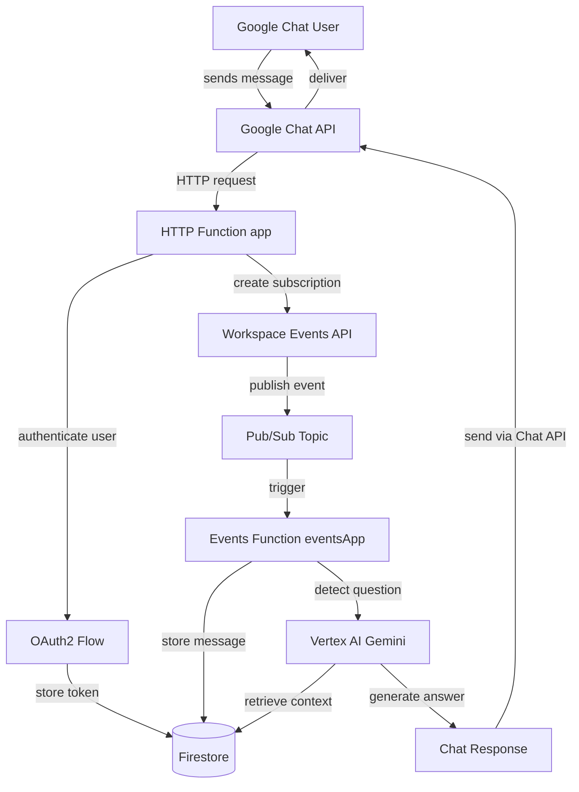

# Bootstrap Cursor Rules - cwayassistant

## Contexto do Projeto

**Tipo:** Google Chat AI Assistant (Node.js 20 + Google Cloud Functions gen2)  
**Arquitetura:** Controllers/services/model (mantida)  
**Stack:** npm, Mocha, ESLint+Prettier (novo), JSDoc+checkJs (novo)  
**Estado:** Projeto existente com 18 arquivos JS, README em português, sem regras Cursor

## Estratégia de Importação de Templates

### Templates Fundamentais a Importar

Importar via extensão Cursor Rules (Command Palette → "Cursor Rules: Add .cursorrules"):

1. **JavaScript/Node.js** - Padrões base (async/await, módulos, erros)
2. **Google Cloud Functions** - Serverless, triggers HTTP/Events, gen2
3. **Testing (Mocha)** - Estrutura de testes, assertions, mocking
4. **API/Backend** - HTTP handlers, middleware, error handling
5. **ESLint + Prettier** - Code quality e formatting standards
6. **Documentation** - JSDoc, README, comentários inline
7. **Git Workflow** - Commits, branches, deploy

### Processo de Importação

Para cada template:

1. Importar via extensão
2. Copiar conteúdo imediatamente → `/.cursor/imports/<template-name>.cursorrules.txt`
3. Atualizar `/.cursor/imports/PROVENANCE.md` com metadados
4. Mapear quais seções vão para root `.cursorrules` vs domain rules

### Fallback se Importação Falhar

Se extensão não conseguir buscar template:

- Listar templates que deveriam ser importados
- Especificar onde cada um deveria ser aplicado
- Marcar com `*` templates que precisam edições

## Estrutura de Regras (Após Importação)

### Root `.cursorrules`

Montar por combinação e deduplicação de templates importados. Seções obrigatórias:

```markdown
## Project Facts
- Node.js 20, Google Cloud Functions gen2
- Controllers/services/model architecture
- Google Chat + Firestore + Vertex AI + Workspace Events

## Definition of Done
- Code passes ESLint + Prettier
- JSDoc em funções públicas
- Tests com Mocha passando
- README.md atualizado se estrutura/fluxo mudou
- package.json atualizado se deps mudaram

## Rules Provenance
Lista de 7 templates do awesome-cursorrules usados como base
Link para /.cursor/imports/PROVENANCE.md
```

### Domain Rules (`/.cursor/rules/*.mdc`)

Expandir templates importados em 8 regras de domínio:


| Arquivo               | Propósito                              | Template Base                |
| --------------------- | -------------------------------------- | ---------------------------- |
| `architecture.mdc`    | Convenções controllers/services/model  | JavaScript + API/Backend     |
| `code-style.mdc`      | ESLint, Prettier, JSDoc, naming        | ESLint+Prettier + JavaScript |
| `testing.mdc`         | Padrões Mocha, Supertest, mocks        | Testing (Mocha)              |
| `cloud-functions.mdc` | HTTP/Events triggers, gen2, env        | Google Cloud Functions       |
| `google-apis.mdc`     | Chat, Firestore, Vertex AI, Events API | API/Backend + Original       |
| `documentation.mdc`   | JSDoc, README updates, inline docs     | Documentation                |
| `security.mdc`        | OAuth2, credentials.json, IAM, secrets | Google Cloud + Original      |
| `workflow.mdc`        | Git commits, deploy.sh, gcloud         | Git Workflow + GCF           |


**Regras Originais (após reuse):**

- `google-apis.mdc`: seções específicas de Google Workspace APIs (rotuladas "Original")
- `security.mdc`: fluxos OAuth2 duais deste projeto (rotuladas "Original")

## Proveniência Detalhada

### `/.cursor/imports/PROVENANCE.md`

Estrutura:

```markdown
# Cursor Rules Provenance

## Import History
Para cada template:
- Source: PatrickJS/awesome-cursorrules path
- Date Imported: 2026-02-12
- Applied To:
  - Root /.cursorrules → seção X
  - /.cursor/rules/Y.mdc → padrões Z
- Modifications: adaptações feitas

## Template Mapping
Tabela: Template | Root Section | Domain Rules Influenced

## Original Rules
Para cada regra original:
- Rationale: por que foi necessária
- Based On: template estendido
- Label: como está rotulada no arquivo
```

### Seção de Proveniência no Root `.cursorrules`

```markdown
## Rules Provenance

Templates base do PatrickJS/awesome-cursorrules:
- JavaScript/Node.js (/cursorrules/javascript/)
- Google Cloud Functions (/cursorrules/cloud/google-cloud/)
- Testing (Mocha) (/cursorrules/testing/mocha/)
- API/Backend (/cursorrules/backend/api/)
- ESLint + Prettier (/cursorrules/linting/eslint-prettier/)
- Documentation (/cursorrules/documentation/)
- Git Workflow (/cursorrules/git/)

Full history: /.cursor/imports/PROVENANCE.md
```

## Documentação Viva

### README.md (migrar para inglês)

**Preservar:** português atual → `README.pt-BR.md`

**Adicionar/melhorar:**

1. **Repository Tree com descrições inline:**

```
cwayassistant/                        # Root directory
├── controllers/                      # HTTP request handlers
│   ├── app.js                        # Main HTTP function (Chat interactions)
│   └── event-app.js                  # Events function (Pub/Sub messages)
├── services/                         # Business logic layer
│   ├── aip-service.js                # Vertex AI / Gemini integration
│   ├── firestore-service.js          # Firestore data access
│   └── ...                           # Auth services (user/app, chat/events)
├── model/                            # Data models and domain logic
├── test/                             # Unit tests (Mocha + Supertest)
├── .cursor/                          # Cursor AI configuration
│   ├── rules/                        # Domain rules (.mdc)
│   └── imports/                      # Template provenance
├── index.js                          # Main entry point
├── http_index.js                     # HTTP function handler
├── events_index.js                   # Events function handler
└── package.json                      # Dependencies and scripts
```

**Descrições breves por pasta (após árvore):**

- controllers: HTTP/Pub/Sub handlers, delegam para services
- services: lógica de negócio, integrações com APIs Google
- model: entidades de domínio e lógica core
- test: testes unitários com Mocha

1. **Mermaid Flowchart aprimorado:**




**Explicação passo a passo (abaixo do flowchart):**

1. User sends message → Google Chat API receives
2. HTTP Function handles OAuth2 authentication
3. Subscription created via Workspace Events API
4. Events published to Pub/Sub when messages created/updated
5. Events Function stores messages in Firestore
6. Vertex AI detects questions and retrieves history
7. Generated answer sent back via Chat API
8. **Seção Rules Provenance:**

Link para `/.cursor/imports/PROVENANCE.md` e lista resumida dos 7 templates.

### AGENTS.md

Criar manual operacional:

**Seções:**

1. **Project Overview** - O que é cwayassistant, tecnologias chave
2. **How to Work with This Codebase**
  - Run: `npm install`, `npm test`
  - Deploy: `./deploy.sh`
  - Lint: `npm run lint`
  - Format: `npm run format`
  - Typecheck: `npm run typecheck`
3. **Architecture Conventions** - Controllers→services→model, testes espelham código
4. **When to Ask vs Assume**
  - Ask: mudanças em OAuth2, schema Firestore, deploy scripts
  - Safe: code style (ESLint/Prettier), test patterns, JSDoc
5. **Keeping Rules and Docs Updated**
  - README.md quando estrutura/fluxo muda
  - package.json quando deps mudam
  - /.cursor/rules/ quando novos padrões emergem
  - /.cursor/imports/PROVENANCE.md quando templates importados
6. **Rules Provenance Process**
  - Reuse templates primeiro
  - Extend em /.cursor/rules/ conforme necessário
  - Label regras originais explicitamente

## Configurações de Tooling

### package.json

**Adicionar devDependencies:**

```json
{
  "eslint": "^8.56.0",
  "prettier": "^3.2.0",
  "eslint-config-prettier": "^9.1.0",
  "eslint-plugin-node": "^11.1.0"
}
```

**Adicionar scripts:**

```json
{
  "lint": "eslint .",
  "format": "prettier --write .",
  "format:check": "prettier --check .",
  "typecheck": "node --check *.js controllers/**/*.js services/**/*.js model/**/*.js"
}
```

### `.eslintrc.json`

```json
{
  "env": {
    "node": true,
    "es2022": true
  },
  "extends": ["eslint:recommended", "prettier"],
  "parserOptions": {
    "ecmaVersion": 2022
  },
  "rules": {
    "no-unused-vars": ["error", { "argsIgnorePattern": "^_" }],
    "no-console": "off"
  }
}
```

### `.prettierrc.json`

```json
{
  "semi": true,
  "singleQuote": true,
  "trailingComma": "es5",
  "printWidth": 80,
  "tabWidth": 2
}
```

### `jsconfig.json`

```json
{
  "compilerOptions": {
    "checkJs": true,
    "target": "ES2022",
    "module": "commonjs",
    "moduleResolution": "node"
  },
  "include": ["**/*.js"],
  "exclude": ["node_modules"]
}
```

## Node.js Environment

### Inspeção

1. Verificar versão Node.js (deve ser 20+ para Cloud Functions gen2)
2. Listar pacotes instalados: `npm list --depth=0`
3. Identificar missing: eslint, prettier, plugins

### Instalação

```bash
npm install --save-dev eslint prettier eslint-config-prettier eslint-plugin-node
```

### Validação

```bash
npm list eslint prettier
node --version
```

## Decision Log

Criar `/docs/adr/0001-cursor-rules-bootstrap.md`:

```markdown
# ADR 0001: Cursor Rules Bootstrap

## Status
Accepted

## Context
cwayassistant carecia de regras Cursor estruturadas, padrões de documentação, e tooling configs para linting/formatting/type-checking.

## Decision
Bootstrap sistema de instruções em camadas:
1. Import/reuse templates do awesome-cursorrules
2. Expand em /.cursor/rules/ domain rules (.mdc)
3. Add tooling: ESLint + Prettier + JSDoc checkJs
4. Migrate README to English (preserve Portuguese)
5. Maintain provenance em /.cursor/imports/PROVENANCE.md

## Architecture Kept
- Controllers/services/model (sem mudanças)
- npm package manager (sem migração)
- Mocha testing (sem migração para Jest)

## Tooling Added
- ESLint + Prettier (padrão indústria Node.js)
- JSDoc + checkJs (type safety gradual sem migração TypeScript)

## Living Documentation
README.md e package.json devem ser atualizados após toda task futura que muda arquivos.

## Consequences
- Positive: comportamento consistente do AI agent, padrões claros, melhor DX
- Negative: overhead inicial para manter regras e proveniência
- Mitigation: AGENTS.md fornece guidance claro sobre quando/como atualizar
```

## Regra de Living Updates

**Estabelecer em AGENTS.md:**

Após bootstrap, para toda task futura que cria/modifica/deleta arquivos:

1. **Atualizar README.md:**
  - Refresh repo tree se estrutura mudou
  - Refresh Mermaid flowchart se fluxo lógico mudou
2. **Atualizar package.json:**
  - Add/remove dependencies conforme código muda
  - Manter política de pinning consistente
3. **Atualizar proveniência se regras/templates adicionados:**
  - `/.cursor/imports/PROVENANCE.md`
  - Seção `## Rules Provenance` em `/.cursorrules`
4. **Mencionar no summary da task:** o que mudou em README, deps, provenance

## Arquivos Criados/Modificados

**Novos (~17 arquivos):**

- `/.cursorrules`
- `/.cursor/rules/architecture.mdc`
- `/.cursor/rules/code-style.mdc`
- `/.cursor/rules/testing.mdc`
- `/.cursor/rules/cloud-functions.mdc`
- `/.cursor/rules/google-apis.mdc`
- `/.cursor/rules/documentation.mdc`
- `/.cursor/rules/security.mdc`
- `/.cursor/rules/workflow.mdc`
- `/.cursor/imports/PROVENANCE.md`
- `/.cursor/imports/javascript-nodejs.cursorrules.txt`
- `/.cursor/imports/google-cloud-functions.cursorrules.txt`
- `/.cursor/imports/testing-mocha.cursorrules.txt`
- `/.cursor/imports/api-backend.cursorrules.txt`
- `/.cursor/imports/eslint-prettier.cursorrules.txt`
- `/.cursor/imports/documentation.cursorrules.txt`
- `/.cursor/imports/git-workflow.cursorrules.txt`
- `/AGENTS.md`
- `/README.pt-BR.md` (cópia do atual README.md)
- `/.eslintrc.json`
- `/.prettierrc.json`
- `/jsconfig.json`
- `/docs/adr/0001-cursor-rules-bootstrap.md`

**Modificados (~3 arquivos):**

- `/README.md` (migrate to English, enhance diagrams, add provenance)
- `/package.json` (add devDeps, scripts)
- `/.gitignore` (add .cursor/imports/*.txt se necessário)

## Definition of Done

- 7 templates fundamentais importados e snapshotted em `/.cursor/imports/`
- Proveniência registrada: `PROVENANCE.md` + seção em `/.cursorrules`
- 8 domain rules criadas em `/.cursor/rules/*.mdc`
- README.md enhanced: tree diagram, Mermaid flowchart, provenance section
- README.pt-BR.md criado (preserva português original)
- AGENTS.md criado com operating manual
- package.json atualizado: devDeps (eslint, prettier) + scripts
- Tooling configs criados: `.eslintrc.json`, `.prettierrc.json`, `jsconfig.json`
- Node.js env inspecionado e devDeps instalados: `npm install`
- Decision log criado: `/docs/adr/0001-cursor-rules-bootstrap.md`
- Living update rule estabelecida e documentada em AGENTS.md

