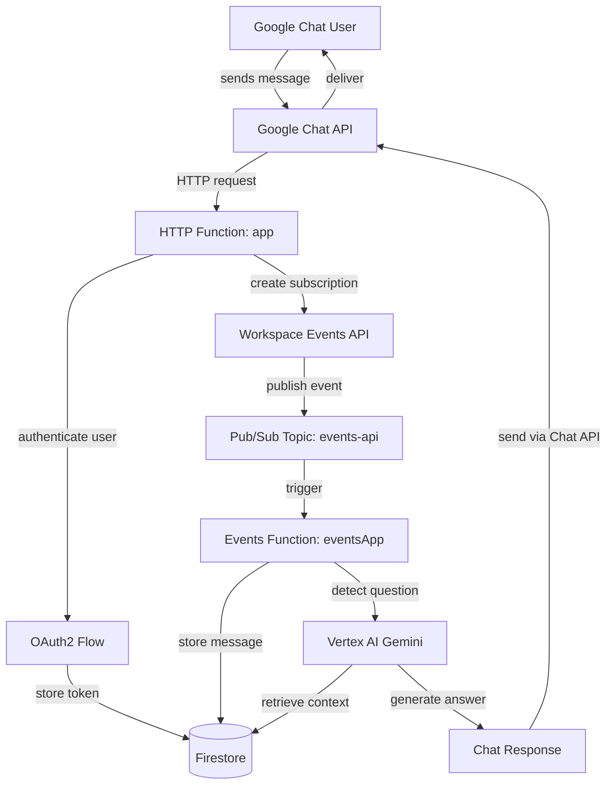

# cwayassistant - AI Knowledge Assistant for Google Chat

[](./.cursor/imports/PROVENANCE.md)
[](./.cursor/plans/)
[]()

AI Knowledge Assistant for Google Chat that answers questions based on conversation history in spaces. The app uses Vertex AI with Gemini for analysis and answer generation, monitors messages in real-time via Workspace Events API + Pub/Sub, and stores history in Firestore.

## 📋 Overview

**cwayassistant** is a Google Chat app that:
- Answers questions based on conversation history in the space
- Uses Vertex AI with Gemini for analysis and intelligent answer generation
- Monitors messages in real-time via Workspace Events API + Pub/Sub
- Stores message history in Firestore
- Supports both user OAuth2 and app-level authentication

## 🏗️ Architecture

The app is implemented as two Google Cloud Functions (Cloud Run gen2):

### Repository Structure

```
cwayassistant/                        # Root directory
├── .cursor/                          # Cursor AI configuration
│   ├── imports/                      # Template provenance and snapshots
│   │   ├── PROVENANCE.md             # Full import history and template mapping
│   │   └── *.cursorrules.txt         # Imported template snapshots
│   ├── plans/                        # Plan mode artifacts
│   └── rules/                        # Domain-specific agent rules (.mdc)
│       ├── architecture.mdc          # Controllers/services/model conventions
│       ├── cloud-functions.mdc       # GCF gen2 patterns, HTTP/Events triggers
│       ├── code-style.mdc            # ESLint, Prettier, JSDoc standards
│       ├── documentation.mdc         # JSDoc requirements, README maintenance
│       ├── google-apis.mdc           # Chat, Firestore, Vertex AI, Events API
│       ├── security.mdc              # OAuth2, credentials, secrets management
│       ├── testing.mdc               # Mocha patterns, mocking, coverage
│       └── workflow.mdc              # Git commits, branching, PR guidelines
├── .vscode/                          # VSCode configuration
│   ├── extensions.json               # Recommended extensions
│   └── settings.json                 # Workspace settings
├── controllers/                      # HTTP/Pub/Sub request handlers
│   ├── app.js                        # Main HTTP function (Chat interactions)
│   └── event-app.js                  # Events function (Pub/Sub messages)
├── docs/                             # Documentation
│   └── adr/                          # Architecture Decision Records
│       └── 0001-cursor-rules-bootstrap.md
├── model/                            # Data models and domain logic
│   ├── events.js                     # Event types and handlers
│   ├── exceptions.js                 # Custom error classes
│   └── message.js                    # Message entity
├── services/                         # Business logic layer
│   ├── aip-service.js                # Vertex AI / Gemini integration
│   ├── app-auth-chat-service.js      # App-level auth for Chat API
│   ├── app-auth-events-service.js    # App-level auth for Events API
│   ├── firestore-service.js          # Firestore data access
│   ├── user-auth-chat-service.js     # User OAuth2 for Chat API
│   ├── user-auth-events-service.js   # User OAuth2 for Events API
│   └── user-auth.js                  # User auth utilities
├── test/                             # Unit tests (Mocha + Supertest)
│   ├── events_index.test.js          # Tests for Events function
│   └── http_index.test.js            # Tests for HTTP function
├── .cursorrules                      # Root Cursor AI rules
├── .eslintrc.json                    # ESLint configuration
├── .gitignore                        # Git ignore rules
├── .prettierrc.json                  # Prettier configuration
├── AGENTS.md                         # Agent operating manual
├── credentials.json                  # OAuth2 credentials (gitignored, local only)
├── credentials.json.template         # Template for credentials (no secrets)
├── deploy.sh                         # Deployment script
├── env.js                            # Environment configuration
├── events_index.js                   # Events function entry point
├── http_index.js                     # HTTP function entry point
├── index.js                          # Main entry point (exports both functions)
├── jsconfig.json                     # JSDoc type checking configuration
├── package.json                      # Node.js dependencies and scripts
├── package-lock.json                 # NPM lock file
├── README.md                         # This file
└── README.pt-BR.md                   # Portuguese version
```

### Folder Descriptions

- **controllers**: Handle incoming HTTP requests and Pub/Sub events; delegate to services (no business logic)
- **services**: Business logic, API integrations (Vertex AI, Firestore, Google Chat, Workspace Events)
- **model**: Domain entities and core logic (Message, Events, Exceptions)
- **test**: Unit tests using Mocha and Supertest
- **.cursor**: Cursor AI configuration (rules, templates, provenance)

## 🔄 Logical Flow



### Flow Step-by-Step

1. **User sends message** → Google Chat API receives it
2. **HTTP Function handles interaction** → Authenticates user via OAuth2, stores tokens in Firestore
3. **Subscription created** → Workspace Events API subscription for real-time message monitoring
4. **Events published** → When messages are created/updated, events are published to Pub/Sub topic
5. **Events Function triggered** → Processes event from Pub/Sub, stores message in Firestore
6. **Question detection** → Vertex AI Gemini detects if message is a question
7. **Context retrieval** → Retrieves conversation history from Firestore
8. **Answer generation** → Gemini generates intelligent answer based on context
9. **Response delivery** → Answer sent back to Chat via Chat API

## 🚀 Quick Start

### Prerequisites

- Google Workspace Business or Enterprise account
- Google Cloud project with billing enabled
- Node.js 20 or later
- gcloud CLI installed and authenticated

### Required APIs

Enable the following APIs in Google Cloud Console:

```bash
gcloud services enable \
  cloudfunctions.googleapis.com \
  run.googleapis.com \
  cloudbuild.googleapis.com \
  eventarc.googleapis.com \
  pubsub.googleapis.com \
  firestore.googleapis.com \
  workspaceevents.googleapis.com \
  chat.googleapis.com \
  aiplatform.googleapis.com
```

### Configuration

1. **Clone the repository**:
   ```bash
   git clone https://github.com/hugo-borba/cwayassistant.git
   cd cwayassistant
   ```

2. **Configure `env.js`**:
   ```javascript
   const env = {
     project: 'your-project-id',      // Google Cloud project ID
     location: 'us-central1',          // Region for Vertex AI
     topic: 'events-api',              // Pub/Sub topic name
     logging: true,
   };
   ```

3. **Configure OAuth2 (`credentials.json`)**:
   - Create OAuth2 credentials in Google Cloud Console
   - Download JSON file and save as `credentials.json` in root
   - Configure redirect URI: `https://REGION-PROJECT_ID.cloudfunctions.net/app/oauth2`

4. **Create Firestore database**:
   - Go to Firestore in Google Cloud Console
   - Create database in "Native" mode

5. **Install dependencies**:
   ```bash
   npm install
   ```

### Development Workflow

```bash
# Run tests
npm test

# Run linter
npm run lint

# Check formatting
npm run format:check

# Auto-format code
npm run format

# Type check JSDoc
npm run typecheck

# Run all quality gates
npm run lint && npm run format:check && npm run typecheck && npm test
```

### Deployment

Execute deployment script:

```bash
./deploy.sh
```

Or deploy manually:

```bash
# Deploy HTTP function
gcloud functions deploy app \
  --gen2 \
  --region=us-central1 \
  --runtime=nodejs22 \
  --source=. \
  --entry-point=app \
  --trigger-http \
  --allow-unauthenticated

# Deploy Events function
gcloud functions deploy events-app \
  --gen2 \
  --region=us-central1 \
  --runtime=nodejs22 \
  --source=. \
  --entry-point=eventsApp \
  --trigger-topic=events-api
```

### Configure Google Chat App

1. Access Google Chat API in Google Cloud Console
2. Configure:
   - **Name**: cwayassistant
   - **Avatar URL**: (URL of your image)
   - **Description**: AI Knowledge Assistant
   - **Functionality**: "Join spaces and group conversations"
   - **Connection Settings**: URL of HTTP function `app` endpoint
   - **Visibility**: Configure authorized users/domains

## 🧪 Testing

Run unit tests:

```bash
npm test
```

Run with coverage:

```bash
npm run test:coverage
```

## 📚 Documentation

- [Google Chat HTTP App Tutorial](https://developers.google.com/workspace/add-ons/chat/quickstart-http)
- [AI Concepts for Chat Apps](https://codelabs.developers.google.com/chat-apps-ai-concepts)
- [Workspace Events API](https://developers.google.com/workspace/events)
- [Vertex AI](https://cloud.google.com/vertex-ai)

## 🔐 Quality Standards

This project enforces 8 quality standard categories:

- **A. Code Quality**: Complexity limits, naming conventions, async/await patterns
- **B. Testing**: ≥70% coverage overall, ≥90% in services
- **C. Security**: No hardcoded secrets, OAuth2 best practices, input validation
- **D. Documentation**: JSDoc 100% public functions, README maintenance
- **E. Reliability**: Error handling, retry logic, timeouts
- **F. Performance**: Cold start optimization, caching, Firestore indexing
- **G. Maintainability**: Controllers/services/model pattern, DRY principle
- **H. Git & Workflow**: Conventional commits, PR reviews, semantic versioning

Full quality framework details in `.cursor/plans/bootstrap_cursor_rules_node.js_*.plan.md`.

## 📜 Rules Provenance

This project uses Cursor AI rules bootstrapped from the following templates:

**Reused Templates** (from [PatrickJS/awesome-cursorrules](https://github.com/PatrickJS/awesome-cursorrules)):
- **JavaScript/Node.js** - ES Module patterns, async/await, error handling
- **API/Backend** - RESTful principles, HTTP status codes, error responses
- **Testing/Mocha** (adapted from Jest) - Test structure, mocking patterns
- **Git Workflow** - Conventional commits, branching strategy

**Original Templates** (created for this project):
- **Google Cloud Functions** - GCF gen2 patterns, HTTP/Events triggers, cold start optimization
- **ESLint + Prettier** - Code quality standards, formatting configuration
- **Documentation** - JSDoc requirements, README maintenance, ADR format
- **Security** - Dual OAuth2 flows (user + app), credentials management
- **Google APIs** - Chat API, Workspace Events API, Firestore, Vertex AI integration

**Full provenance details:** [.cursor/imports/PROVENANCE.md](.cursor/imports/PROVENANCE.md)

**Domain rules expansion:** See [.cursor/rules/](.cursor/rules/) for detailed, domain-specific rules.

## 🤝 Contributing

This is a private project for internal use. To contribute:

1. Create a branch: `git checkout -b feature/my-feature`
2. Commit your changes with conventional commits: `git commit -m 'feat: add new feature'`
3. Push to branch: `git push origin feature/my-feature`
4. Open a Pull Request with clear description

**Before submitting:**
- Run quality gates: `npm run lint && npm run format:check && npm run typecheck && npm test`
- Update README if structure/flow changed
- Update JSDoc comments
- Follow architecture rules (controllers/services/model)

See [AGENTS.md](AGENTS.md) for detailed contribution guidelines and "When to Ask vs Assume" guidance.

## 🔄 Upstream Sync

This project is a fork of [googleworkspace/add-ons-samples](https://github.com/googleworkspace/add-ons-samples).

To sync changes from the original repository:

```bash
git fetch upstream
git log HEAD..upstream/main --oneline
# Analyze relevant commits
git cherry-pick <commit-hash>
```

See complete instructions: [docs/FORK_SETUP.md](docs/FORK_SETUP.md)

## 📝 Living Documentation

**CRITICAL:** After every task that modifies files:

1. **Update README.md** if:
   - File/folder structure changed
   - Logical flow changed
   - Environment variables changed

2. **Update package.json** if:
   - Dependencies added/removed
   - Scripts added/modified

3. **Update /.cursor/rules/*.mdc** if:
   - New patterns emerge
   - Quality standards change

4. **Update /.cursor/imports/PROVENANCE.md** if:
   - New templates imported
   - Existing templates updated

## 📄 License

Apache 2.0 - See [LICENSE](LICENSE) for details.

## 🔗 Useful Links

- [Google Workspace Add-ons](https://developers.google.com/workspace/add-ons)
- [Google Chat API](https://developers.google.com/chat)
- [Vertex AI Documentation](https://cloud.google.com/vertex-ai/docs)
- [Firestore Documentation](https://cloud.google.com/firestore/docs)
- [Cursor AI Rules Bootstrap Plan](.cursor/plans/)
- [AGENTS.md - Operating Manual](AGENTS.md)

---

**Version:** v0.1 (Bootstrap Initial - 2026-02-12)  
**Maintained By:** Cursor AI Agent + Team  
**Language Versions:** [English](README.md) | [Português](README.pt-BR.md)
